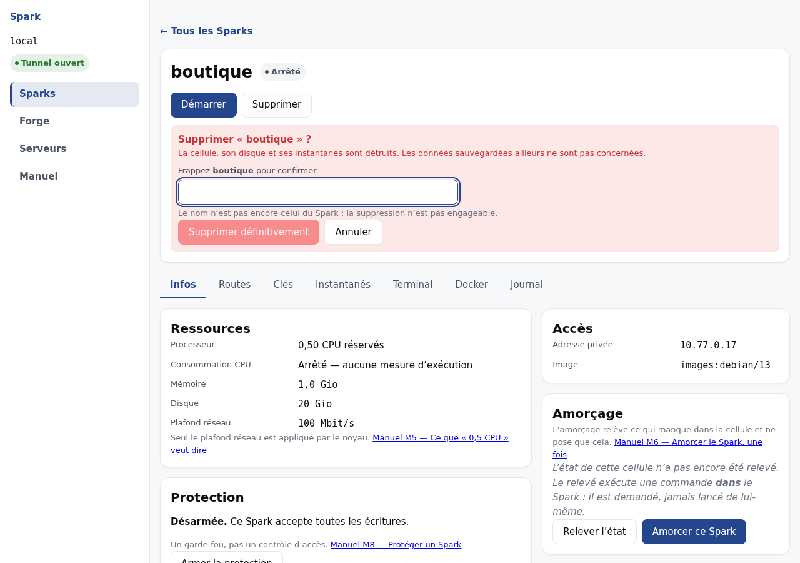
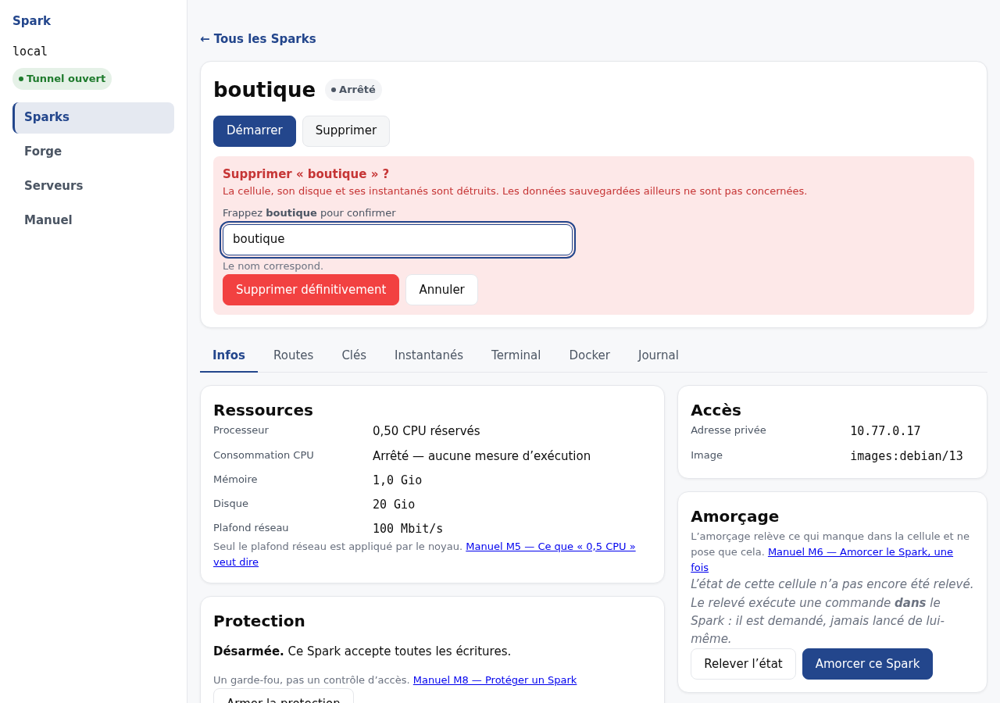

# M10 · Supprimer un Spark

## Ce qui est détruit

La cellule, son disque et **tous ses instantanés**. Les routes publiques qui
pointaient vers elle cessent d'être servies.

## Ce qui est libéré

Le processeur, la mémoire, le disque et le débit qu'elle réservait retournent aux
pools de la Forge — et son adresse privée redevient attribuable.

La ressource n'est rendue qu'**à la disparition effective** du Spark : un Spark
arrêté continue de consommer ses quotas. C'est voulu : ce qui lui est promis doit
rester disponible quand il redémarrera.

## Ce qui n'est pas concerné

Vos sauvegardes applicatives, si elles sont ailleurs. C'est précisément la raison
pour laquelle un instantané n'en est pas une (voir [M9](M9-instantanes.md)).

## Irréversible

Il n'y a pas de corbeille. La confirmation nomme le Spark et énonce la
conséquence avant que le bouton destructif ne soit atteignable.

### Vous devez frapper le nom

Le bouton *Supprimer définitivement* reste **désactivé** tant que vous n'avez pas
frappé le nom exact du Spark dans le champ. Il ne disparaît pas : il est là, et
l'écran vous dit pourquoi il ne part pas.

Le nom est comparé **exactement** : ni la casse, ni un espace en trop ne passent.
Ce n'est pas une chicanerie — deux Sparks dont les noms ne diffèrent que par la
casse peuvent coexister, et les accepter l'un pour l'autre annulerait tout
l'intérêt du geste.

Ce que cela protège : le mauvais Spark sélectionné, la ligne cliquée trop vite.
Une confirmation ordinaire prouve que vous avez **vu** l'écran ; frapper le nom
prouve que vous avez lu **lequel**. C'est la seule différence qui compte le jour
où vous vous êtes trompé de fenêtre.

Ce que cela ne protège pas : rien sur l'identité de qui agit. Si quelqu'un
d'autre est à votre console, il frappera le nom aussi bien que vous.

Aucun autre geste du produit ne le demande, et c'est délibéré : une frappe
demandée plusieurs fois par jour deviendrait un réflexe, et un réflexe ne lit
plus.

## Quand la cellule a déjà disparu

Il arrive qu'une cellule soit supprimée **en dehors du produit** — par une
commande passée à la main sur le serveur, par exemple. La ligne, elle, reste au
registre : elle continue d'occuper de la mémoire et du disque dans les pools,
pour quelque chose qui n'existe plus.

**La suppression réussit quand même.** La ligne part, la place revient, les
routes et les clés suivent. Vous n'avez rien de particulier à faire : le geste
est le même.

Le **journal**, lui, ne présente pas cette suppression comme une autre. Il porte
la mention que la cellule était déjà **absente**, et dit ce que la ligne coûtait.
C'est délibéré : le geste réussit, mais l'écart entre le registre et la machine
mérite d'être vu — il signale que quelque chose s'est passé hors du produit.

### Ce qui reste une panne

Si le serveur ne **répond pas**, la suppression échoue et la ligne reste. Ce
n'est pas la même chose : ne pas pouvoir poser la question n'est pas savoir que
la cellule a disparu. Effacer la ligne dans ce cas risquerait de laisser tourner
une cellule que plus rien ne compte.

### Un Spark protégé refuse d'abord

La protection s'applique avant tout le reste. Une cellule absente n'est pas une
raison de passer outre : levez la protection, puis supprimez.
