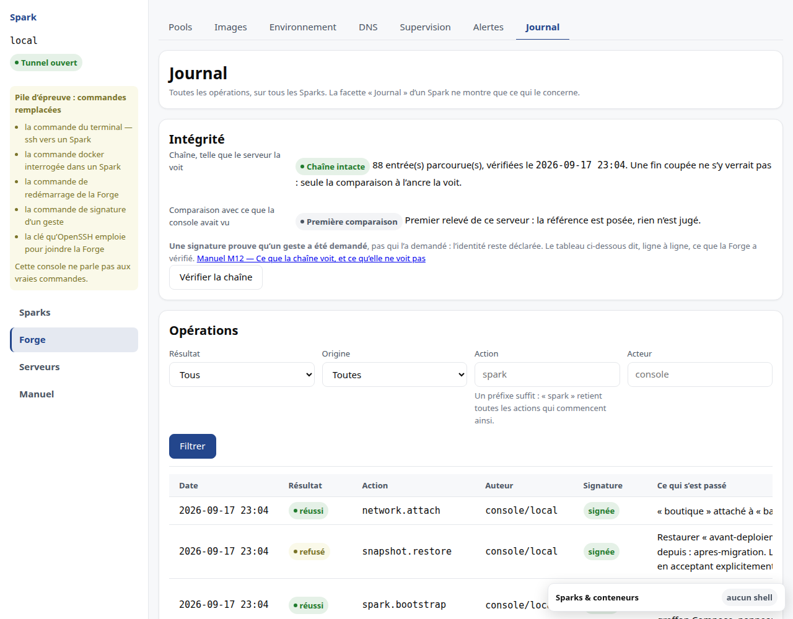
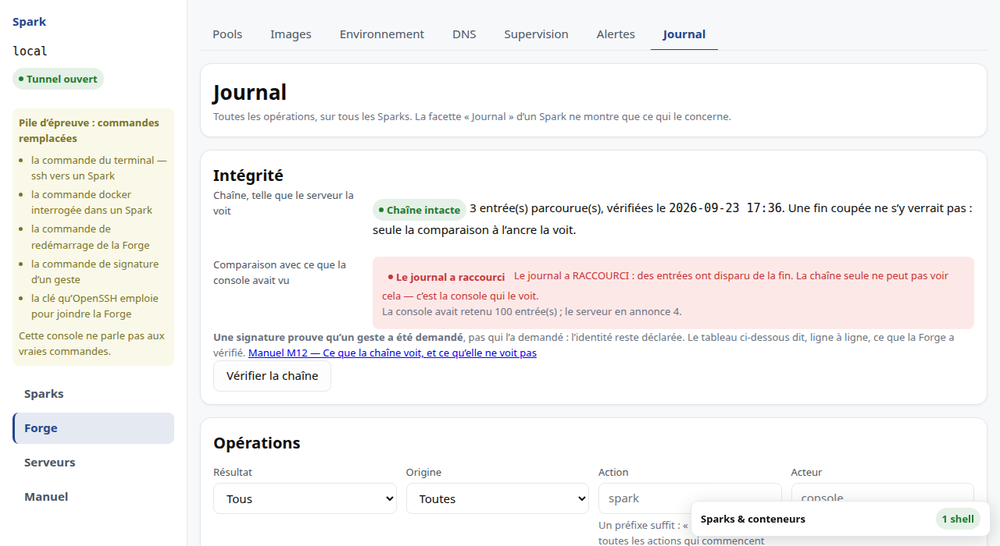

# M12 · Annexes

## Variables d'environnement

Les **noms** figurent ici ; leurs valeurs n'apparaissent jamais dans la
documentation.

### Runtime serveur

| Variable | Rôle | Requis |
|---|---|---|
| `SPARKD_BIND` | adresse d'écoute — refuse toute adresse routable | non |
| `SPARKD_DB` | fichier du registre | non |
| `SPARKD_INCUS_SOCKET` | socket du gestionnaire de conteneurs | non |
| `SPARKD_CADDY_ADMIN` | API d'administration du proxy | non |
| `SPARKD_DRIVER` | pilote d'exécution : réel ou factice | non |
| `SPARKD_STORAGE_POOL` | pool de stockage dont la capacité fait foi | non |
| `SPARKD_MEMORY_RESERVE` | mémoire soustraite du pool pour la Forge, hors ARC | non |
| `SPARKD_LOG_LEVEL` | niveau de journalisation | non |

### Console

| Variable | Rôle | Requis |
|---|---|---|
| `SPARK_CONSOLE_PORT` | port local de la console | non |
| `SPARK_CONSOLE_STATE` | fichier d'inventaire des serveurs | non |

## Journal d'audit

Toute opération qui modifie l'état est tracée, avec son résultat :

| Résultat | Sens |
|---|---|
| réussi | l'opération a abouti |
| refusé | le serveur a refusé — capacité, état, unicité |
| erreur | l'opération a échoué en cours d'exécution |

Les valeurs sensibles y sont caviardées : le corps d'une clé n'y entre jamais.

### Où le lire

**Forge → Journal**. Il couvre **tous** les Sparks, parce qu'une séquence les
traverse souvent. La facette *Journal* d'un Spark reste, et répond à l'autre
question : qu'est-il arrivé à celui-ci.

Quatre filtres. *Action* accepte un **préfixe** : `spark` retient toutes les
actions qui commencent ainsi, ce qui est presque toujours ce qu'on cherche.

Les **lectures ne sont pas journalisées** : elles n'altèrent rien, sont bien plus
nombreuses, et noieraient ce qu'on vient chercher. Deux exceptions, parce
qu'elles disent qui est entré : l'ouverture d'un tunnel, et les vérifications
d'intégrité.

### Qui a fait quoi

Chaque ligne dit son auteur, et distingue deux choses qui n'ont pas la même
valeur :

| Auteur affiché | Sens |
|---|---|
| un nom de serveur, avec l'empreinte d'une clé | un **geste** demandé depuis la console |
| *automatique* | un **événement du serveur** : réconciliation, relevé, conclusion d'une opération |

Les afficher pareillement laisserait croire que le second a été demandé par
quelqu'un. Il ne l'est par personne.

**Cette identité est déclarée, pas prouvée.** La console l'annonce à chaque
appel ; qui atteint le serveur autrement écrit ce qu'il veut. Elle sert à
distinguer des usages légitimes, jamais à établir une responsabilité.

### La colonne « Signature »

Chaque ligne dit aussi ce que le serveur a pu **vérifier** de sa provenance :

| Signature | Sens |
|---|---|
| **signée** | le serveur a vérifié, à la réception, une signature produite par votre clé. Elle prouve que ce geste a bien été **demandé**, et qu'il n'a pas été fabriqué sur le serveur après coup |
| **non signée** | le geste est arrivé sans signature. C'est un état **normal**, pas un défaut : la console n'exige pas de signature pour agir |
| **sans objet** | une ligne écrite par le serveur lui-même. Personne ne l'a demandée, donc personne ne pouvait la signer |

Ce qu'une signature **ne dit pas** : *qui* a agi. Une clé volée signe aussi bien
que la vôtre. Elle répond à une autre question, et c'est celle qui manquait :
*ce geste a-t-il été réellement demandé ?*

Pour que vos gestes soient signés, il faut deux choses :

1. la console connaît la **clé publique** à employer pour ce serveur — le champ
   *clé de signature* de la fiche du serveur ;
2. la clé est **chargée dans votre agent**, ou son fichier privé est à côté de la
   clé publique.

Aucun secret n'est jamais copié : la console demande la signature à votre agent,
qui ne rend jamais la clé privée.

### Quand la console n'a pas pu signer

Elle vous le dit, dans la barre de gauche, sous le nom du serveur :

> **Geste non signé** — Aucun agent ne détient la clé de signature de ce serveur :
> ce geste a bien eu lieu, mais il est parti sans signature. Chargez la clé dans
> votre agent — « ssh-add » — pour que les suivants soient signés.

Trois choses à en retenir :

- **le geste a eu lieu.** Ne le refaites pas. Un arrêt, un démarrage ou une
  suppression n'ont pas été annulés parce qu'ils n'étaient pas signés ;
- ce n'est **pas un refus du serveur** — c'est pourquoi le message n'est pas
  rouge. Ce qui manque est la trace, pas l'action ;
- l'avertissement **disparaît tout seul** dès qu'un geste repart signé. Il reste
  tant que la cause reste, même si vous changez d'écran : la cause est l'état de
  votre poste, pas la page que vous regardez.

### Vérifier que le journal n'a pas été récrit

Chaque entrée porte l'empreinte de la précédente. Le bouton **Vérifier la
chaîne** parcourt le journal et rend l'un de ces deux verdicts :

- *chaîne intacte*, avec le nombre d'entrées et l'heure du contrôle ;
- *chaîne rompue*, avec **l'entrée exacte** et ce qui s'est passé : soit elle a
  été récrite, soit une entrée a été retirée ou insérée juste avant elle.

C'est un **relevé explicite**, comme celui de la topologie ou du catalogue : il
n'est pas rejoué à chaque ouverture de l'onglet. Tant que vous ne l'avez pas
lancé, l'écran dit qu'il ne sait pas — il n'affiche pas « intacte » par défaut.

### Ce que la chaîne ne peut pas voir

Elle détecte qu'une entrée a été **récrite** ou **retirée du milieu**. Elle ne
peut voir ni qu'on a **coupé la fin**, ni qu'on a **remplacé le journal entier** :
qui peut écrire dans le fichier peut aussi recalculer toute la chaîne.

C'est pourquoi l'écran affiche une **seconde ligne** : la comparaison avec ce que
la console avait vu. La console tourne sur votre poste, pas sur le serveur, et
retient la dernière empreinte de tête connue. Deux verdicts sont des alertes :

| Verdict | Ce qu'il veut dire |
|---|---|
| le journal a **raccourci** | des entrées ont disparu de la fin |
| le journal a été **remplacé** | ce que la console avait vu ne s'y trouve plus |

Une chaîne annoncée intacte **avec** l'une de ces alertes est le cas le plus
important de tout ce dispositif : c'est exactement ce à quoi ressemble une
troncature. L'écran ne les résume donc jamais en un seul indicateur.

L'écart est **chiffré** : combien d'entrées la console avait retenues, combien le
serveur en annonce. C'est le recul lui-même qui est la preuve, et il se constate
sans avoir à croire le serveur sur parole.

### L'alerte ne s'efface pas toute seule

Relancer **Vérifier la chaîne** ne fera pas disparaître l'alerte. La console
**ne remplace pas** sa référence sur un verdict d'alerte : elle continue de
comparer à ce qu'elle avait vu avant l'incident. Sinon le signal s'effacerait en
même temps que la preuve, et le relevé suivant paraîtrait normal.

Autrement dit, cette alerte se traite, elle ne se dissipe pas. Ce qu'il faut
faire, dans l'ordre :

1. ne rien redémarrer et ne rien supprimer sur le serveur — l'état est la preuve ;
2. noter les deux nombres affichés et l'heure du relevé ;
3. déterminer qui a eu accès à la machine depuis le dernier relevé sain ;
4. considérer le journal du serveur comme **non fiable** à partir de ce point :
   ce qui manque ne se reconstitue pas.

Ce n'est pas la cryptographie qui apporte la garantie : c'est le fait que la
référence vive ailleurs que sur la machine qu'on soupçonne.

> **Aucune entrée n'est signée.** Le produit ne le prétendra pas tant que ce ne
> sera pas vrai.

### Une bizarrerie de vocabulaire, connue

Les messages du journal sont écrits par le serveur et portent son vocabulaire :
vous y lirez « `starting` → `running` » là où le reste de l'interface affiche
« En marche ». Rien n'est faux, et aucune décision n'en dépend ; c'est un écart
de lisibilité, identifié, dont l'arbitrage n'est pas encore rendu.

## Messages courants

| Message | Ce qu'il veut dire | Que faire |
|---|---|---|
| « Aucun tunnel ouvert vers … » | la console n'a pas pu joindre le serveur | vérifier l'accès SSH et le nom du serveur dans l'inventaire |
| « Capacité insuffisante — … il manque … » | l'admission a refusé : la ressource nommée manque | réduire la demande, supprimer un Spark, ou consulter [M4](M4-pools.md) |
| « Ce Spark n'a pas encore d'adresse » | le Spark est déclaré mais pas appliqué | l'appliquer depuis son écran détail |
| « Restauration de … refusée : … plus récents seraient détruits » | des instantanés postérieurs bloquent | les supprimer, ou accepter explicitement leur perte ([M9](M9-instantanes.md)) |
| « La topologie de cette Forge n'a pas encore été relevée » | le registre ignore la capacité de la machine | cliquer sur **Relever la topologie** ([M4](M4-pools.md)) |
| « Pas encore appliqué — rien à mesurer » | le Spark n'a jamais tourné | ce n'est pas une erreur |

## Où lire la suite

- l'architecture et les mesures : [DAT](../DAT.md) ;
- l'état réel de chaque fonctionnalité : [backlog](../BACKLOG.md).

Il n'y a aujourd'hui **aucune incohérence connue non résolue** : le registre qui
les recensait a été supprimé quand sa dernière entrée a été traitée. Il
réapparaîtra sous `docs/INCONSISTENCY_REPORT.md` le jour où un écart sera
constaté — un registre vide qu'on garde par habitude se lit comme un registre
qu'on ne tient plus.
