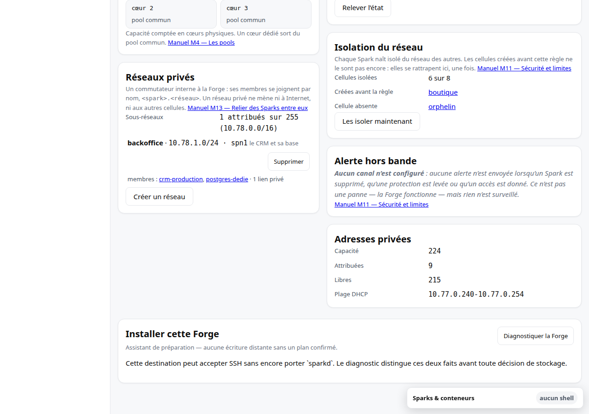
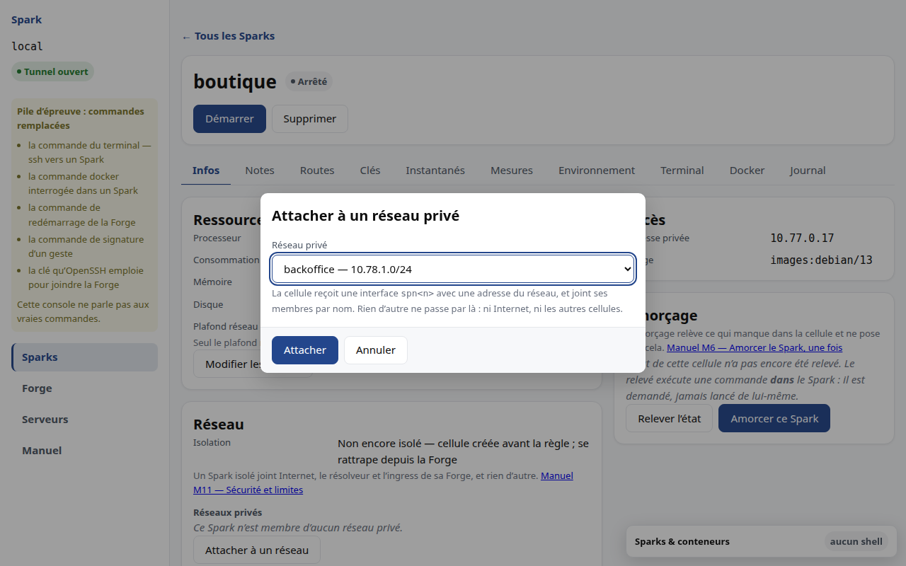
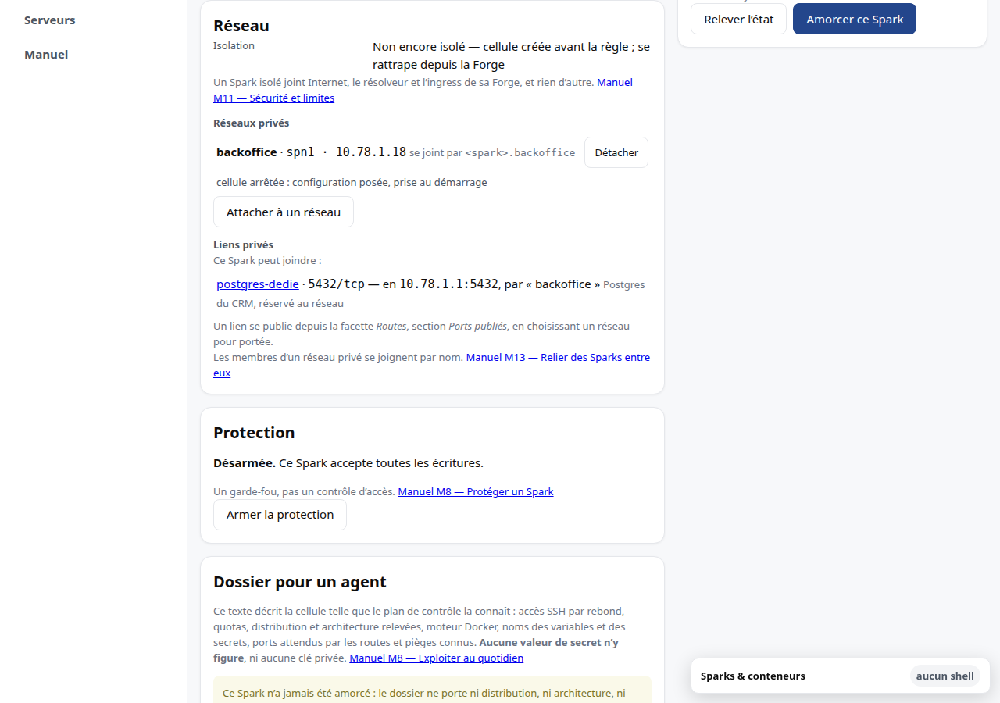
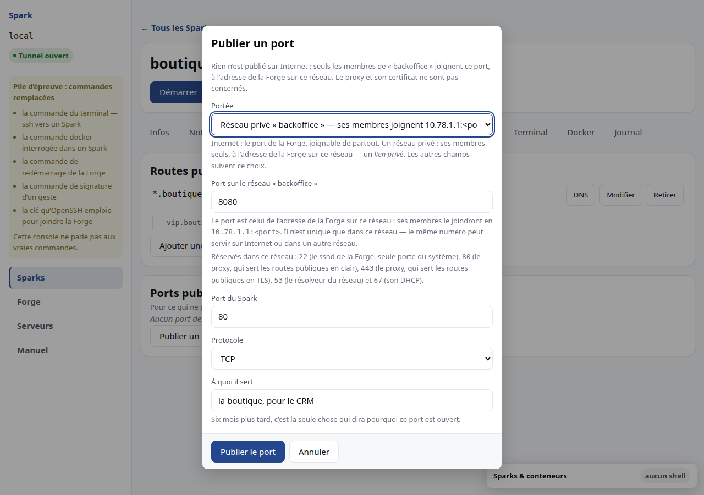

# M13 · Relier des Sparks entre eux

Chaque Spark est isolé du réseau des autres (voir [M11](M11-securite.md)). Quand
deux Sparks doivent se parler à dessein — une application et sa base, un CRM et
son moteur de recherche —, vous les reliez par un **réseau privé**.

## Ce qu'est un réseau privé

Un réseau privé est un commutateur interne à la Forge : un nom, un sous-réseau,
des membres. Il n'y a ni tunnel, ni chiffrement, ni serveur distant : les
membres sont des Sparks de la même Forge, et leur trafic est commuté en mémoire.

Ce qu'il n'est pas :

- **une sortie vers Internet** — un Spark sort par sa propre interface, jamais
  par un réseau privé ;
- **un chemin vers les autres Sparks de la Forge** — seuls les membres se
  voient ; un Spark qui n'est pas membre reste injoignable, même s'il connaît
  l'adresse ;
- **un chemin vers la Forge elle-même** ;
- **une bande passante réservée** — le trafic entre membres n'est ni plafonné
  ni garanti.

Un Spark peut être membre de plusieurs réseaux privés.

## Créer un réseau privé

Écran **Forge**, section *Réseaux privés*. La section liste les réseaux
existants — nom, sous-réseau, interface, note, membres — et compte les
sous-réseaux attribués sur le pool de la Forge.



*Créer un réseau* ouvre une fenêtre qui demande :

- un **nom** : minuscules, chiffres et tirets, comme un nom DNS — c'est lui que
  les membres utiliseront pour se joindre, et l'aide sous le champ le montre
  pendant que vous tapez ;
- **à quoi il sert** : une note libre, pour la personne suivante.

Le sous-réseau est attribué par le produit, sur le pool de la Forge
(`10.78.0.0/16`, par tranches de 256 adresses) : vous ne choisissez pas
d'adresses. Un nom déjà pris est refusé, en le disant, dans la fenêtre.

## Attacher un Spark

Dossier du Spark, onglet **Infos**, section *Réseau* — sous l'état d'isolation,
la liste *Réseaux privés*. *Attacher à un réseau* ouvre une fenêtre qui propose
les réseaux dont ce Spark n'est pas encore membre. S'il est déjà membre de tous,
la fenêtre le dit, et renvoie à l'écran Forge pour en créer un.



Une fois attaché, la ligne dit tout ce que la cellule a reçu : le réseau,
l'interface — `spn1`, du même nom sur la Forge et dans la cellule —, l'adresse,
et le nom par lequel les autres membres le joignent.



Dans la cellule, `ip addr show spn1` montre l'interface avec cette adresse.
Rien à configurer : le produit a posé ce qu'il fallait. Un Spark **arrêté**
reçoit sa configuration tout de suite et son interface au démarrage suivant ;
la ligne le précise — « cellule arrêtée : configuration posée, prise au
démarrage ».

Un Spark **protégé** (voir [M8](M8-exploiter.md)) refuse l'attachement et le
détachement : les boutons restent visibles, indisponibles, et disent de lever
la protection d'abord.

## Se joindre par nom

Les membres d'un réseau se nomment `<spark>.<réseau>` : dans le réseau
`backoffice`, le Spark `postgres-dedie` se joint depuis `crm-production` par
`postgres-dedie.backoffice`. Ce nom est résolu par le résolveur du réseau privé,
que la cellule reçoit avec son adresse ; depuis la cellule, `ping
postgres-dedie.backoffice` répond.

Depuis un conteneur Compose, utilisez le même nom, et vérifiez-le une fois
depuis le conteneur — `getent hosts postgres-dedie.backoffice` — car un moteur
Docker n'emprunte pas toujours le résolveur de sa cellule. Si le nom n'y résout
pas, l'**adresse** affichée par le dossier fait l'affaire : elle est réservée
au Spark sur ce réseau et ne change pas tant qu'il en est membre.

```yaml
services:
  crm:
    image: registry.example.net/crm:1.4
    environment:
      DATABASE_URL: postgres://crm@postgres-dedie.backoffice:5432/crm
```

Pour **servir** sur le réseau privé, un service écoute sur la cellule comme il
le ferait pour l'ingress — `ports: ["5432:5432"]` dans son Compose. Il est
alors joignable par les membres du réseau, et par eux seuls : rien n'est publié
sur Internet pour autant (voir [M7](M7-domaine.md) pour ce qui l'est).

## Détacher, supprimer

*Détacher*, sur la ligne du réseau dans le dossier du Spark, se confirme sur
place : l'interface disparaît de la cellule, et le Spark cesse de joindre les
membres. Rien n'est détruit — ni le Spark, ni le réseau.

Un réseau se supprime depuis l'écran Forge, après confirmation. **Un réseau qui
a encore des membres n'est pas supprimé** : le refus les nomme, et vous les
détachez d'abord, un par un. Le sous-réseau d'un réseau supprimé revient au
pool.

## Publier un port dans un réseau privé : le lien privé

Un membre d'un réseau joint les autres membres, et tout ce qu'ils servent.
Quand vous voulez qu'un Spark **hors du réseau** offre *un seul* de ses ports à
ses membres — la base de données d'un autre projet, un cache partagé —, vous
publiez ce port **dans le réseau** : c'est un *lien privé*.

Dossier du Spark qui expose, onglet **Routes**, section *Ports publiés*,
*Publier un port*. Le premier champ est la **portée** : *Internet* — le port de
la Forge, joignable de partout, comme avant — ou un réseau privé. L'option d'un
réseau dit déjà l'adresse que ses membres emploieront, et le reste de la
fenêtre suit ce choix : le champ devient « Port sur le réseau « x » », son aide
donne cette adresse, et l'avertissement sur le certificat du proxy disparaît —
rien n'est publié sur Internet.



Une fois publié, la ligne du port dit sa portée et l'adresse à employer :
« 5432/tcp dans « backoffice » → port 5432 du Spark · ses membres le joignent
en 10.78.1.1:5432 ». Les membres du réseau joignent cette adresse, et rien
d'autre du Spark exposé : ni ses autres ports, ni son adresse privée, ni son
propre réseau. Le Spark exposé, lui, voit l'adresse du membre qui le joint —
utile pour ses journaux et ses listes d'accès.

Dans la section *Réseau* de chaque dossier, sous *Liens privés*, le Spark
exposant lit ce qu'il expose, et chaque membre lit ce qu'il **peut joindre**,
avec l'adresse. Le port n'est jamais publié sur Internet pour autant : un port
n'est unique que dans sa portée, et le `5432` d'un réseau ne dispute rien à
celui d'Internet.

Un lien se retire comme un port, depuis la section *Ports publiés* : les
membres cessent de le joindre immédiatement, rien n'est détruit. Un réseau qui
porte encore un lien ne se supprime pas : le refus le nomme.

## Quand la cellule ne se configure pas seule

Le produit configure l'interface dans la cellule par `systemd-networkd` — c'est
le cas d'Ubuntu et de Debian. Sur une autre famille (Alpine, BusyBox), le
device et l'adresse sont posés, mais l'interface reste à configurer : la ligne
du dossier le dit — « interface non configurée dans la cellule » — et vous
configurez `spn<n>` en DHCP vous-même, avec l'outil de la famille. L'adresse
reçue sera celle que le dossier affiche : elle est réservée au Spark.

## Ce que le journal garde

Chaque geste laisse une entrée dans le journal de la Forge (voir
[M12](M12-annexes.md)) : `network.create`, `network.attach`, `network.detach`,
`network.delete` ; un lien s'y lit comme un port, `port.publish` et
`port.withdraw`, avec sa portée. Un refus de suppression y figure aussi, comme
un refus, avec les membres et les liens qui restaient.
