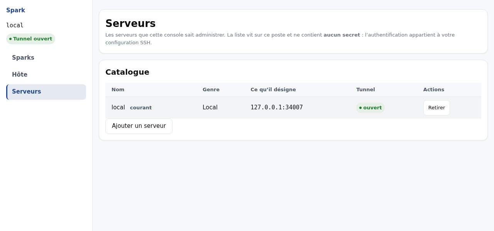
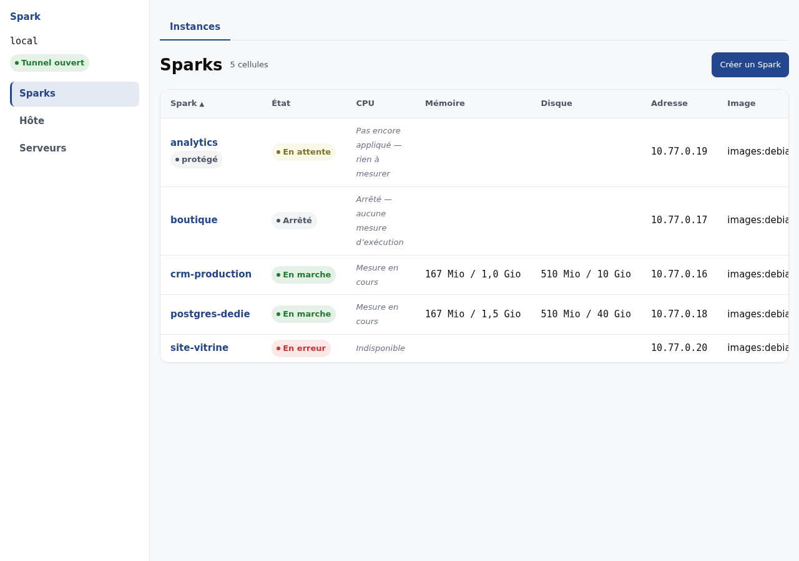

# M3 · Ouvrir la console

La console est une application **locale**. Elle tourne sur votre poste et
n'expose rien sur le réseau. Elle administre un ou plusieurs serveurs à travers
un tunnel SSH.

## Lancer

```
make runDev
```

La console répond alors sur `http://127.0.0.1:5173`.

## Déclarer un serveur

La destination **Serveurs** tient la liste de ce que cette console sait
administrer. C'est de là que vous ajoutez, basculez et retirez.



Trois manières de déclarer un serveur, et la première est presque toujours la
bonne :

| Genre | Ce que vous saisissez | Qui résout le reste |
|---|---|---|
| **Alias ssh** | un `Host` de votre `~/.ssh/config` | OpenSSH : hôte, utilisateur, port, rebond, clé |
| **SSH** | hôte, utilisateur, port | rien de plus |
| **Local** | un port | rien : `sparkd` écoute déjà sur cette machine |

L'alias est recommandé dès que votre connexion sort du cas trivial. Un rebond par
un bastion, une clé dédiée, un port inhabituel : tout cela se décrit déjà dans
`~/.ssh/config`, et le produit n'a pas à le redécrire. Les `Host` de ce fichier
vous sont **proposés**, jamais ajoutés d'office — vous pouvez aussi en saisir un
que la console ne connaît pas, s'il vit dans un fichier inclus.

### Éprouver avant d'enregistrer

Le bouton **Éprouver la connexion** ouvre un tunnel temporaire, demande au
serveur s'il est en bonne santé et s'il est prêt, puis referme. Le résultat
s'affiche sous les champs.

**Il ne bloque rien.** Un serveur sans réponse s'enregistre quand même : la
machine est peut-être simplement éteinte, ou pas encore installée. Exiger qu'elle
réponde reviendrait à exiger qu'elle soit allumée pour que vous puissiez noter
son existence.

### Basculer, et retirer

Le serveur que vous regardez est signalé **courant** dans la liste, et son nom
apparaît en haut de la barre latérale. *Regarder* bascule ; le choix est retenu
d'une session à l'autre.

*Retirer* ferme le tunnel et efface la déclaration, après une confirmation qui
nomme le serveur. **Le serveur lui-même n'est pas touché** : ni ses Sparks, ni
ses données, ni sa configuration. Vous ne faites qu'oublier son adresse.

### Aucun secret, jamais

**L'inventaire ne contient jamais de secret.** Ni mot de passe, ni phrase de
passe, ni clé : l'authentification appartient à votre configuration SSH. Un champ
qui ressemble à un secret est refusé à l'écriture plutôt que filtré en silence,
pour que vous sachiez le retirer d'où vous l'aviez copié.

La vérification de la clé d'hôte n'est **jamais** désactivée par le produit, pas
même pour simplifier une première connexion. Un changement de clé d'hôte est un
signal, et vous devez le voir.

### Quand le tunnel tombe

Un tunnel rompu porte un bouton **Reconnecter**, en haut de la barre latérale.
Il n'y a pas à recharger la console.

## Se repérer

La console a **trois niveaux**, et la forme de chacun dit ce qui va changer quand
vous cliquez :

| Niveau | Ce que c'est | Forme |
|---|---|---|
| 1 | les destinations — Sparks, Hôte | barre latérale, à gauche |
| 2 | les sous-parties d'une destination — Pools, Images sous Hôte | onglets |
| 3 | un Spark ouvert, avec ses facettes — Infos, Routes, Clés, Instantanés, Journal | onglets de sa fenêtre |

Le **serveur courant** et l'état de son tunnel sont au-dessus de la barre
latérale : ce n'est pas une destination, c'est le contexte de toutes les
destinations. On ne « va » pas au serveur comme on va aux Sparks.

Chaque onglet a sa propre adresse. Vous pouvez donc recharger la page sur
« Instantanés », ou en partager le lien.

Sous 1024 px, la barre latérale passe en haut. Elle garde ses libellés : un
pictogramme seul n'est pas une navigation.

## Saisir

Les trois niveaux ci-dessus servent à **regarder**. Pour **saisir**, la console
ouvre une fenêtre par-dessus l'écran — une *modale* —, et son titre est celui de
la section d'où vous l'avez ouverte : une saisie ouverte depuis « Routes » ne
touche que les routes.

Ce qu'elle vous garantit, au clavier comme à la souris :

- le curseur est déjà dans le premier champ à l'ouverture ;
- la tabulation reste dans la saisie et ne repart pas dans la page derrière ;
- `Échap` referme, et refermer vaut annuler ;
- à la fermeture, le focus revient sur le bouton qui l'avait ouverte ;
- un refus du serveur s'affiche **dans** la saisie, sans rien effacer de ce que
  vous avez tapé.

Sous 768 px, elle occupe l'écran entier — mêmes garanties.

Les **confirmations**, elles, ne sont pas des modales : elles s'affichent à
l'endroit du geste, sous la ligne concernée. Une saisie et une confirmation ne
demandent pas la même chose, et ne se ressemblent donc pas.

## L'état du tunnel

La console **ouvre elle-même** le tunnel du serveur courant à son démarrage, et
en affiche l'état en permanence, en haut à droite :

| État | Ce qu'il veut dire |
|---|---|
| en cours | le tunnel s'établit |
| ouvert | `sparkd` répond à travers le tunnel |
| rompu | le tunnel ne répond plus |



L'état « ouvert » n'est jamais posé sans preuve : la console interroge `sparkd`
**à travers** le tunnel. Un processus `ssh` vivant mais figé ne suffit pas — il
serait déclaré rompu, ce qui est la vérité utile.

## Quand le tunnel tombe

La console affiche un bandeau et **cesse d'afficher des données**. Elle ne montre
pas les valeurs précédentes : une valeur périmée prise pour vraie vous ferait
décider sur un état qui n'existe plus.

Le message reprend la sortie d'erreur de `ssh` — « clé refusée », « hôte
inconnu » —, pour vous éviter de relancer la commande à la main pour la lire.
