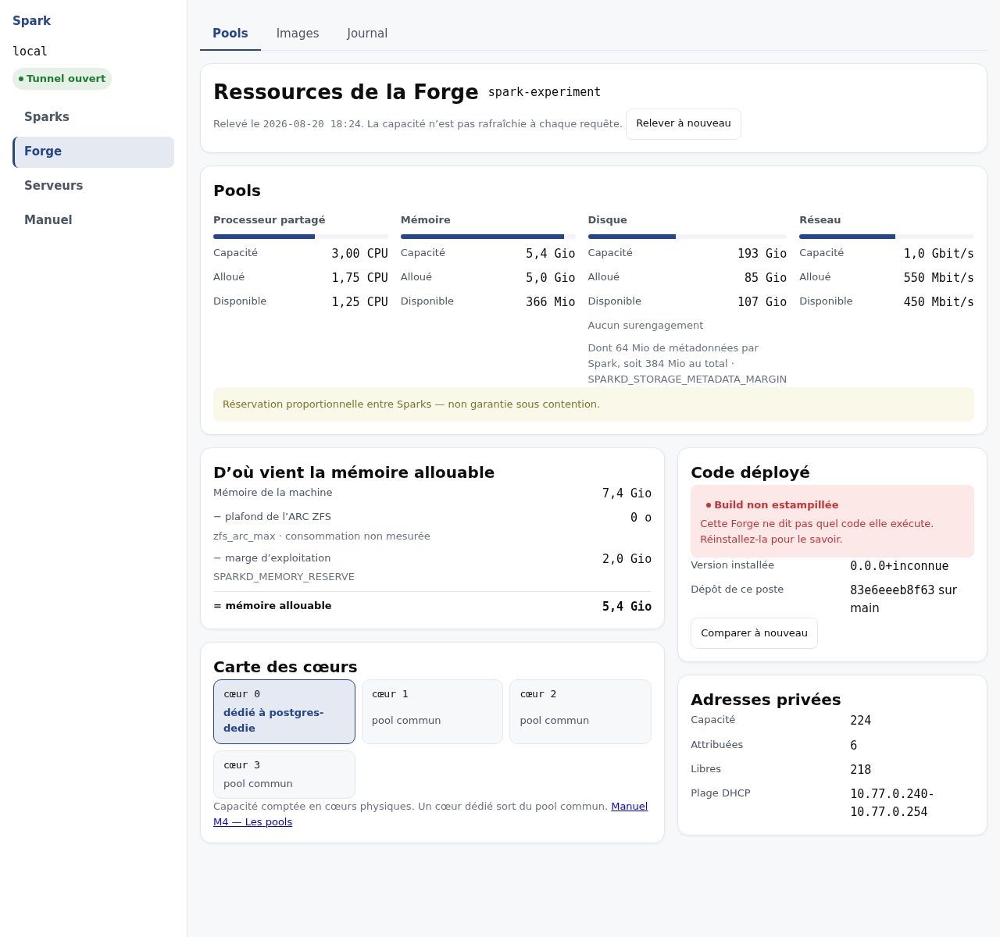
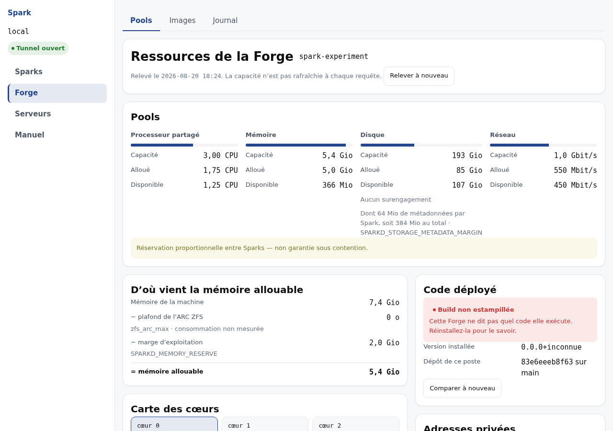

# M4 · Lire les pools de ressources

L'onglet **Forge** répond à une seule question : *pourquoi cette création
serait-elle refusée, et de combien ?*



## Trois grandeurs, jamais deux

Chaque ressource affiche sa **capacité**, ce qui est **alloué** et ce qui reste
**disponible**. « 4 Gio libres » sans dire sur combien ne permet pas de choisir
entre supprimer un Spark et agrandir la machine.

## Pourquoi la mémoire allouable est inférieure à la mémoire de la machine

L'écran énonce la soustraction terme à terme :

```
mémoire de la machine
  − plafond de l'ARC ZFS        que ZFS peut prendre à tout instant
  − marge d'exploitation        ce que la Forge consomme pour lui-même
  = mémoire allouable
```

Chaque terme indique le réglage qui le commande : `zfs_arc_max` pour l'ARC,
`SPARKD_MEMORY_RESERVE` pour la marge. Sans cette décomposition, vous sauriez
qu'il manque de la mémoire sans savoir quelle vanne tourner.

La ligne de l'ARC indique aussi **ce qu'il consomme à cet instant**, face à son
plafond. C'est ce qui permet de juger si la réserve est bien dimensionnée :

- mesuré sur la Forge de validation, l'ARC **atteint** son plafond dès qu'on lui
  donne assez à lire — la réserve n'est donc pas une précaution, elle est
  nécessaire : sans elle, ces gigaoctets seraient promis aux Sparks puis repris ;
- il ne le **dépasse pas** — la réserve est donc suffisante, et l'augmenter ne
  ferait que retirer de la mémoire aux Sparks.

Un ARC affiché à 100 % de son plafond n'est pas une alerte : c'est son
fonctionnement normal. Si la consommation n'est pas mesurable, l'écran le dit
plutôt que d'afficher zéro — un ARC dont on ignore la taille n'est pas un ARC
vide.

Tant que la topologie n'a pas été relevée depuis la migration qui distingue les
deux termes, l'écran affiche la somme sans inventer sa répartition.

## Pourquoi l'alloué du disque dépasse la somme des tailles vendues

Additionnez cinq Sparks de 10 Gio, l'écran en annonce un peu plus. L'écart est
voulu, et l'écran le nomme sous la carte du disque.

Le quota posé sur chaque Spark n'est jamais exactement la taille vendue : une
**marge de métadonnées** s'y ajoute, invisible du locataire. Sans elle, un Spark
qui remplit son disque empêche le runtime d'écrire ses propres métadonnées à
l'intérieur du même quota — et à partir de là, plus aucune reconfiguration ne
passe, pas même l'agrandissement qui débloquerait la situation. Autrement dit :
sans cette marge, un locataire qui sature son disque vous enferme dehors.

La marge est réellement prise sur le pool, elle est donc comptée : l'alloué que
vous lisez est ce qui est réellement engagé, et non ce qui a été promis.

Le locataire, lui, ne la voit jamais : la limite de son Spark reste ce que vous
lui avez vendu, et il atteindra bien 100 % à cette valeur. La marge n'est pas de
l'espace offert, c'est de la place gardée.

Elle se règle par `SPARKD_STORAGE_METADATA_MARGIN`, et l'écran le rappelle. La
poser à zéro est possible et supprime le remède avec elle.

## Le surengagement

Une capacité de « 4 cœurs × 2 » n'est pas huit processeurs. Le facteur est donc
affiché à côté de la capacité.

**Le disque n'en a aucun, et c'est délibéré** : un pool CPU saturé se traduit par
de la lenteur, qu'un ordonnanceur lisse ; un pool de disque saturé est une panne
dure que rien ne rattrape.

## La carte des cœurs

Un Spark en mode **dédié** ne consomme pas de réservation : il **retire** ses
cœurs du pool commun, ce qui réduit la capacité de tous les autres. La carte le
montre cœur par cœur, faute de quoi vous verriez le pool rétrécir sans qu'aucune
allocation n'augmente.

La capacité se compte en cœurs **physiques**. Le SMT entrelace l'exécution, il
n'ajoute pas de capacité : compter les threads reviendrait à vendre deux fois la
même chose.

## Le relevé n'est pas continu

La capacité affichée date du dernier relevé, dont la date accompagne toujours les
chiffres. Le bouton **Relever à nouveau** la rafraîchit ; il ne détruit rien et ne
demande donc aucune confirmation.

## Quel code cette Forge exécute

L'écran porte une section **Code déployé**. Elle répond à une question qu'on ne
peut pas se poser trop tôt : *cette Forge exécute-t-elle bien la correction que
j'ai poussée ?*

Sans elle, « c'est déployé » est une croyance — rien ne distingue une Forge à
jour d'une Forge oubliée depuis trois semaines, et le premier diagnostic part
d'une hypothèse fausse.

La console compare l'empreinte que la Forge publie au dépôt **de votre poste**.
Six réponses, et une seule dit que tout va bien :

| Ce que vous lisez | Ce que cela veut dire | Que faire |
|---|---|---|
| **À jour** | même code des deux côtés | rien |
| **En retard — N commits d'écart** | votre dépôt porte du code que la Forge n'exécute pas | redéployer |
| **C'est ce poste qui est en retard** | la Forge exécute du code plus récent que le vôtre | récupérer, **ne pas redéployer** |
| **Build étrangère à ce dépôt** | son commit est inconnu ici | rien à conclure |
| **Build non estampillée** | elle ne dit pas quel code elle exécute | réinstaller |
| **Aucun dépôt sur ce poste** | il n'y a rien ici à quoi comparer | rien à conclure |

**Les trois dernières ne sont pas des pannes**, ce sont des non-réponses. La
console préfère dire qu'elle ne sait pas plutôt que d'afficher « à jour » : c'est
précisément au moment où l'on a besoin d'elle qu'un « à jour » inventé ferait le
plus de dégâts.

**La troisième mérite qu'on s'y arrête.** Si votre poste est en retard sur la
Forge, l'écran ne le signale pas en rouge, et ce n'est pas une omission :
redéployer dans ce cas remplacerait le code de la machine par une version *plus
ancienne*. Récupérez d'abord.



Une **version installée** apparaît à côté du verdict. Si elle se termine par
`.sale`, l'arbre déployé avait des modifications non committées — c'est licite,
on corrige parfois en urgence, mais la console ne vous le cache pas.

La comparaison se refait avec **Comparer à nouveau**. Elle ne touche pas à la
Forge : elle relit ce que celle-ci publie déjà, et regarde votre dépôt local.

## Une limite à connaître

La réservation CPU n'est aujourd'hui proportionnelle **qu'entre Sparks** : elle
est arbitrée contre les tranches système de la Forge et n'est pas une garantie
absolue. L'écran le dit, et le dira autrement le jour où ce sera faux.
