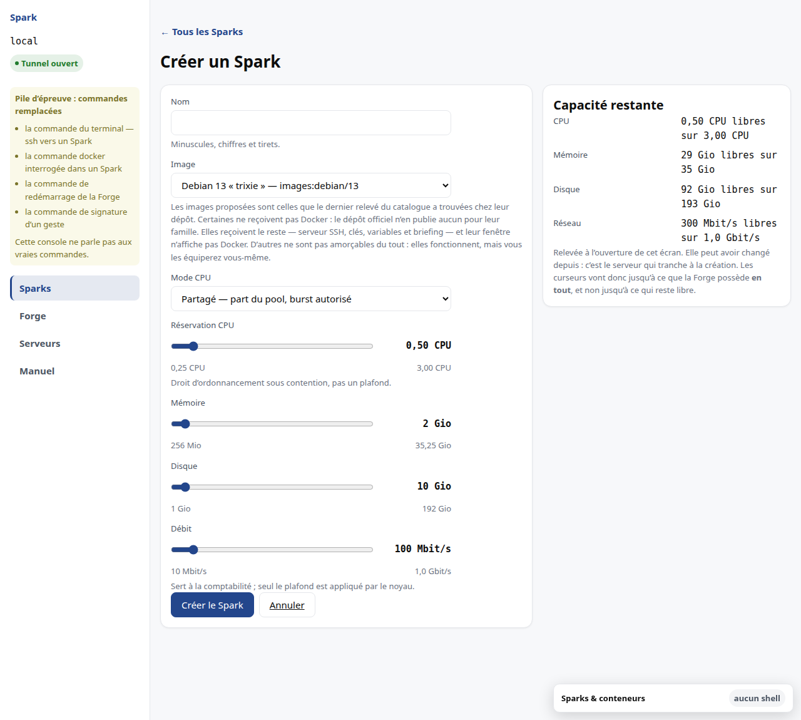
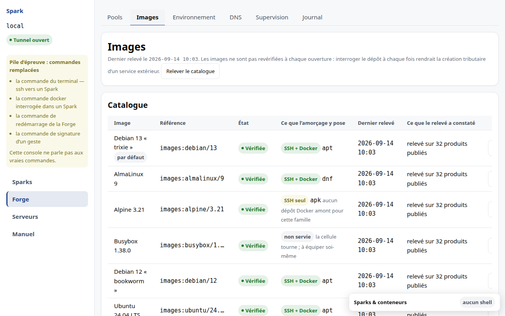
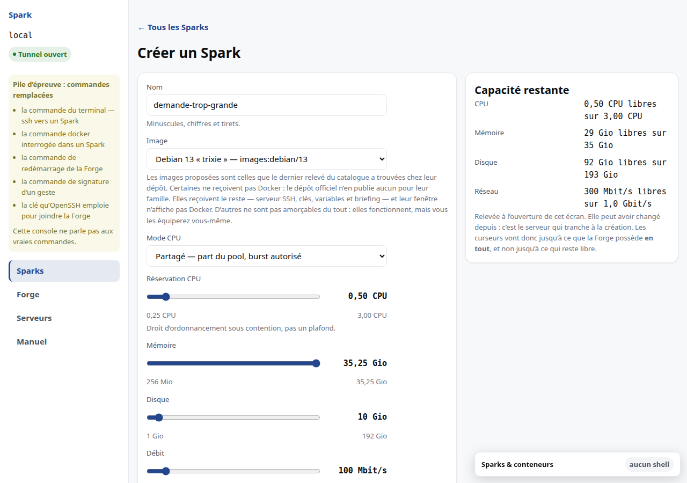

# M5 · Créer un Spark

L'écran affiche la capacité restante à gauche de votre saisie. **Il ne vous
interdit rien sur cette base** : le bouton n'est jamais désactivé parce que
l'estimation locale juge la demande trop grande.

La raison est concrète : cette capacité est une photographie prise à l'ouverture
de l'écran. Un Spark supprimé depuis l'a rendue fausse — dans le sens favorable.
Bloquer sur une valeur périmée refuserait une création que le serveur aurait
acceptée, sans que vous puissiez le savoir.

## Régler les quotas

Les quotas se règlent au **curseur**. Chaque curseur affiche sa valeur en clair,
avec son unité, et ses deux bornes sous la piste. Au clavier : les flèches
avancent d'un cran, `Origine` et `Fin` vont aux extrémités, `Page préc.` et
`Page suiv.` se déplacent par bonds.

**Un curseur va jusqu'à ce que la machine possède *en tout*, pas jusqu'à ce qui
reste libre.** Ce n'est pas une erreur d'affichage. Le panneau de droite peut
annoncer 64 Gio disponibles pendant que le curseur monte à 76 : vous avez le
droit de demander plus que le disponible, parce que ce disponible est une
photographie qui peut avoir changé depuis, et parce que c'est le serveur qui
tranche — pas l'écran. Si la demande ne passe pas, vous obtenez un refus qui
chiffre ce qui manque, et votre saisie reste intacte.

**Certains quotas restent des champs de saisie, et c'est voulu.** Un curseur n'a
de sens que si sa plage se parcourt à la main sans perdre la précision utile. Sur
une machine dont le pool disque dépasse le millier de gibioctets, un curseur au
gibioctet compterait plusieurs milliers de crans : impossible à viser, et un pas
plus grossier rendrait un quota courant de 10 Gio inatteignable. Le disque s'y
saisit donc au clavier, pendant que la mémoire et le débit restent des curseurs.

De même, si la capacité de la machine n'a pas pu être relevée, tous les quotas
redeviennent des champs de saisie : sans bornes connues, il n'y a pas de curseur
possible, et l'écran préfère le dire plutôt que d'inventer une limite.

## Choisir l'image

L'image se choisit dans une **liste**, alimentée par le catalogue du serveur. Les
entrées proposées sont celles que le **dernier relevé** a trouvées chez leur
dépôt.

Il n'y a plus de saisie libre, et c'est délibéré : une référence inexistante
passait autrefois tous les contrôles, la cellule était enregistrée et ses quotas
engagés, et le refus n'arrivait qu'à l'application. Une faute de frappe coûtait
un Spark en erreur à supprimer.

Pour employer une image absente de la liste, il faut l'**ajouter au catalogue** —
un geste distinct, qui déclenche sa vérification. Le formulaire de création ne
sert pas de porte d'entrée à une référence inconnue.

Le catalogue vit sous **Forge → Images**, parce qu'il décrit le serveur et non un
Spark. Le bouton *Ajouter une image* y ouvre une saisie limitée à cette section.

Une entrée ajoutée naît **non relevée** : elle n'est pas encore proposée à la
création. C'est *Relever le catalogue* qui interroge le dépôt et tranche. L'état
vient donc toujours d'une vérification, jamais d'une déclaration.

## Les quatre modes CPU

| Mode | Quand le choisir |
|---|---|
| **partagé** | le défaut, et le bon choix pour presque tout |
| **plafonné** | quand vous voulez interdire le burst, par exemple pour un environnement de recette qui ne doit jamais gêner la production |
| **dédié** | base de données, compilation, inférence — tout ce qui souffre du partage |
| **épinglé partagé** | localité mémoire souhaitée, sans exclusivité |

### Ce que « 0,5 CPU » veut dire

C'est un **droit d'ordonnancement sous contention**, pas un plafond. Quand la
machine est libre, votre Spark consommera davantage, et c'est normal : mesuré, un
Spark réservant 0,5 CPU en consomme presque 2 sur une Forge au repos. L'interface
appelle cela un *burst* et ne le signale pas comme une anomalie.

Ce que ce n'est pas : une garantie que 0,5 CPU vous sera réservé quoi qu'il
arrive sur la machine (voir [M4](M4-pools.md)).

En mode **plafonné**, à l'inverse, la valeur réglée est une limite réellement
appliquée — et elle est provisionnée en entier, parce que vous pouvez la
consommer en permanence.

## Ce que « 10 Gio » de disque veut dire

**10 Gio stockés, après compression.** Le stockage compresse à la volée, et le
quota compte ce qui est réellement écrit sur le disque, pas ce que votre pile
croit avoir écrit.

Mesuré : dans un quota de 2 Gio, 8 Gio de zéros n'ont consommé que 24 Kio,
tandis que 2 Gio de données incompressibles l'ont épuisé exactement.

L'écart joue donc **toujours en votre faveur** : avec des données compressibles —
des journaux, du texte, du JSON — vous logez davantage que ce que vous avez
demandé ; avec des données déjà compressées — images, archives, vidéos — vous
obtenez exactement votre quota. Vous n'en obtenez jamais moins.

## Le débit réseau

Seul le **plafond** est appliqué par le noyau. La réservation réseau sert à la
comptabilité : elle empêche de survendre le lien, elle ne garantit pas une bande
passante.

## Lire un refus

Un refus vient toujours du serveur, jamais d'un contrôle de l'interface. Il
**chiffre ce qui manque**, dans l'unité que vous avez réglée, et **votre saisie
reste intacte** : vous corrigez la valeur fautive sans tout reprendre.

Deux contrôles restent locaux, et ils ne portent pas sur la capacité : la syntaxe
du nom, et la cohérence du mode CPU avec les champs affichés. Ce sont des
questions de forme, que le serveur revérifie de toute façon.
