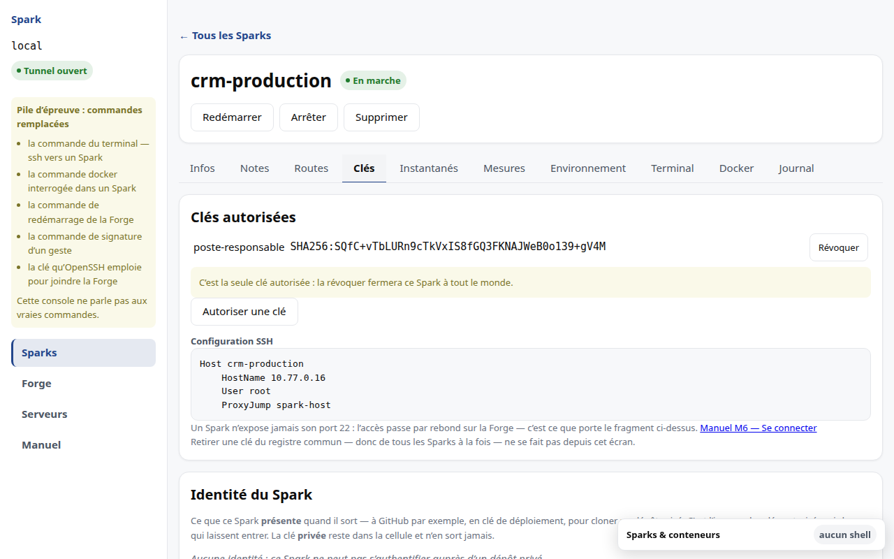

# M6 · Accéder à un Spark



## Autoriser une clé

Le panneau **Clés autorisées** accorde à ce Spark une clé du registre commun, ou
enregistre une clé nouvelle qui sera accordée dans la foulée.

**Seules des clés publiques sont acceptées.** Une clé privée collée par erreur
est refusée par le registre — pas détectée plus tard, refusée à l'écriture.
L'empreinte affichée est celle qu'`ssh-keygen -lf` affiche, pour que vous
puissiez comparer sans traduire.

Révoquer ne demande pas de confirmation : le geste est réversible, la clé reste
au registre. Mais révoquer la **dernière** clé ferme le Spark à tout le monde, et
le panneau vous le dit avant le geste.

Retirer une clé du **registre commun** — donc de tous les Sparks à la fois — ne
se fait pas depuis cet écran.

## Se connecter

Un Spark **n'expose jamais son port 22**. L'accès se fait par rebond sur la Forge,
dont le `sshd` est la seule porte du système. La console vous donne le fragment à
coller dans votre `~/.ssh/config` :

```sshconfig
Host mon-spark
    HostName 10.77.0.x
    User root
    ProxyJump spark-host
```

Ce fragment est produit par le serveur à partir du registre. Ne le retapez pas :
vous créeriez une seconde vérité sur l'adresse.

Le serveur SSH du Spark n'accepte que l'authentification par clé. Le mot de passe
est désactivé, y compris pour `root` : un Spark n'a pas de mot de passe à
deviner.

## Déployer votre pile

Une fois connecté, vous êtes sur une Forge Docker à vous :

```
scp docker-compose.yml mon-spark:/srv/
ssh mon-spark
cd /srv && docker compose up -d
```

Rien à réécrire. Docker vit à l'intérieur du Spark et vous appartient.

**Ne pilotez pas le proxy de la Forge depuis Compose.** L'exposition d'un domaine
se déclare dans la console (voir [M7](M7-domaine.md)) : c'est le registre qui
connaît l'adresse de votre Spark, et deux mécanismes écrivant la même
configuration finissent par diverger.

> **Mesuré sur matériel réel**, pas sur la pile de développement : une pile
> Compose complète tourne dans un Spark non privilégié, sous AppArmor actif et
> sans contournement. La pile de développement, elle, ne lance aucun conteneur —
> elle sert à apprendre l'interface. Voir le §13 du [DAT](../DAT.md).
