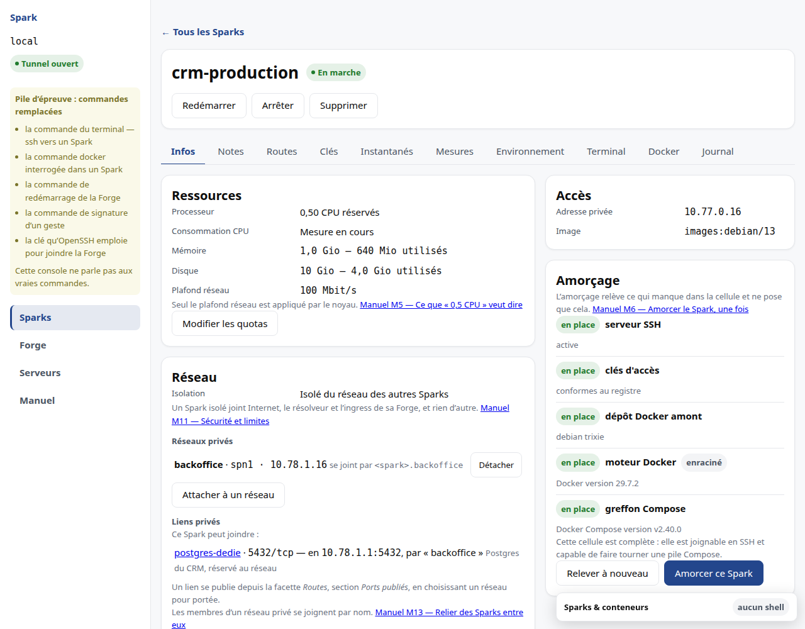

# M6 · Accéder à un Spark


## Autoriser une clé

Le panneau **Clés autorisées** accorde à ce Spark une clé du registre commun, ou
enregistre une clé nouvelle qui sera accordée dans la foulée.

**Seules des clés publiques sont acceptées.** Une clé privée collée par erreur
est refusée par le registre — pas détectée plus tard, refusée à l'écriture.
L'empreinte affichée est celle qu'`ssh-keygen -lf` affiche, pour que vous
puissiez comparer sans traduire.

Révoquer ne demande pas de confirmation : le geste est réversible, la clé reste
au registre. Mais révoquer la **dernière** clé ferme le Spark à tout le monde, et
le panneau vous le dit avant le geste.

Retirer une clé du **registre commun** — donc de tous les Sparks à la fois — ne
se fait pas depuis cet écran.

## Amorcer le Spark, une fois

**Un Spark neuf n'a ni serveur SSH ni moteur Docker.** L'image de base n'en
embarque aucun. Vos clés y sont bien écrites, mais rien n'écoute : la connexion
décrite plus bas ne peut pas aboutir tant que ce premier geste n'a pas eu lieu.

La section **Amorçage**, sur la fiche du Spark, s'en charge.



### Relever d'abord

Le bouton **Relever l'état** regarde ce qui est déjà là. Il n'installe rien, et
il ne part pas tout seul : il exécute une commande **dans** votre Spark, et la
console ne s'y invite pas à chaque coup d'œil. Tant que vous ne l'avez pas
demandé, l'écran dit qu'il ne sait pas — il n'affiche pas « tout va bien » par
défaut.

Cinq éléments, chacun avec son état :

| Élément | Ce que c'est |
|---|---|
| serveur SSH | ce qui vous laissera entrer |
| clés d'accès | celles que vous avez autorisées |
| dépôt Docker amont | d'où vient le moteur |
| moteur Docker | ce qui fait tourner votre pile |
| greffon Compose | `docker compose` |

Trois états, et le troisième mérite une explication : **« à corriger »**. Il ne
veut pas dire « absent ». Il veut dire présent *et* inutilisable.

Le cas concret est celui du paquet `docker.io` fourni par Debian. Il s'installe,
il démarre, `docker --version` répond — et **vos conteneurs meurent au
démarrage**, avec une erreur qui ne dit pas pourquoi (`socketpair() failed`). Son
profil de sécurité est trop ancien pour fonctionner dans un Spark. L'amorçage le
remplace par le moteur du dépôt officiel de Docker, qui fonctionne sans rien
désactiver.

C'est pour ce cas que l'écran distingue trois états et non deux : un Spark où
Docker est « présent » peut être un Spark où rien ne tournera.

### Puis amorcer

**Amorcer ce Spark** demande une confirmation, et elle dit ce qui va se passer :
la console exécute des commandes **en root dans la cellule**, sans passer par
SSH — puisque c'est justement ce qui n'existe pas encore. C'est le seul geste du
produit qui emprunte ce chemin en dehors du dépannage, et il est inscrit au
journal sous une entrée qui lui est propre.

**Seuls les manques sont installés.** Ce qui est déjà en place n'est pas touché,
et ce n'est pas une optimisation : réinstaller « au cas où » redémarrerait le
moteur Docker du Spark, donc ce qu'il fait tourner. Vous pouvez donc relancer
l'amorçage sans risque — s'il n'y a rien à faire, il ne fait rien et vous le dit.

Le compte rendu donne le sort de **chaque** ligne : inchangé, installé, ou
échoué. Jamais un « succès » global, qui laisserait croire que tout a été fait
alors qu'on n'a agi que sur une partie.

### Le mode rootless, si vous le voulez

La confirmation propose une case : **installer Docker en mode rootless**. Elle est
décochée, et c'est un choix, pas un oubli.

En rootless, le moteur Docker tourne sous un compte non privilégié *à l'intérieur*
de votre Spark. Trois choses changent, et il vaut mieux les savoir avant :

- **les ports sous 1024 deviennent impossibles à publier dans la cellule.** Si
  votre pile écoute sur 80 ou 443 à l'intérieur, elle ne démarrera pas telle
  quelle ;
- **certaines piles Compose existantes ne fonctionnent pas sans retouche.** Or
  reprendre une pile sans la réécrire est précisément ce que ce produit vous
  promet ;
- **votre Spark est déjà une cellule non privilégiée** sur la Forge. Le rootless
  est une seconde couche, pas la première : vous n'êtes pas sans protection si
  vous ne le cochez pas.

C'est pourquoi le défaut est le mode ordinaire. Le rootless est offert à qui le
demande en connaissance de cause, pas recommandé par défaut.

### Ce choix ne se reprend pas

**Un amorçage ne bascule jamais un Docker déjà installé d'un mode à l'autre**, et
il refuse si vous le lui demandez.

Ce n'est pas une limitation qu'on lèvera : basculer déplacerait le moteur sous un
autre compte, et avec lui vos conteneurs, vos volumes et vos réseaux. Autrement
dit ce qui tourne, sans que vous l'ayez demandé. Le refus vous dit quel mode est
en place et lequel vous avez demandé.

Le choix se fait donc **au premier amorçage**, tant que rien ne tourne — et
l'écran ne vous propose la case qu'à ce moment-là. Ensuite, la ligne *moteur
Docker* vous rappelle dans quel mode votre Spark tourne.

Si un premier amorçage rootless a été interrompu avant que son démon utilisateur
ne démarre, redemander **le même mode rootless** le reprend. Ce n'est pas une
bascule : aucun démon root ne tourne alors, et rien de votre pile n'est déplacé.
Un démon enraciné réellement actif, lui, reste refusé comme ci-dessus.

### Ce que l'amorçage ne fait pas

Il n'installe pas votre application, ne pose pas vos variables, ne gère pas vos
versions. Il rend le Spark joignable et capable de faire tourner une pile
Compose, et s'arrête là.

Un Spark **protégé** refuse l'amorçage : il installe des paquets et redémarre des
services, ce que la protection est là pour arrêter. Levez-la d'abord.

## Se connecter

Un Spark **n'expose jamais son port 22**. L'accès se fait par rebond sur la Forge,
dont le `sshd` est la seule porte du système. La console vous donne le fragment à
coller dans votre `~/.ssh/config` :

```sshconfig
Host mon-spark
    HostName 10.77.0.x
    User root
    ProxyJump spark-host
```

Ce fragment est produit par le serveur à partir du registre. Ne le retapez pas :
vous créeriez une seconde vérité sur l'adresse.

Le serveur SSH du Spark n'accepte que l'authentification par clé. Le mot de passe
est désactivé, y compris pour `root` : un Spark n'a pas de mot de passe à
deviner.

## Lire le briefing, y compris depuis un agent

Le message qui apparaît à l'ouverture d'un shell ne suffit pas à un agent :
`ssh mon-spark 'commande'` ne l'affiche pas. Lisez donc le briefing explicitement,
sans shell interactif :

```bash
ssh mon-spark 'cat /etc/spark/BRIEFING.md'
```

Le même contenu structuré est disponible dans `/etc/spark/briefing.json`. Il
nomme les quotas qui font foi, les routes et ports déjà déclarés, les **noms**
des variables reçues, leurs deux fichiers et les pièges connus. Il ne recopie
jamais de valeur secrète : elles restent dans les fichiers d'environnement
décrits plus haut.

Le plan de contrôle le réécrit après ses changements. Il porte néanmoins une
limite importante : `root` dans votre Spark peut le modifier. Employez-le pour
comprendre la cellule, jamais comme preuve que vous êtes autorisé à agir.

Si la section « Contexte Docker relevé » indique `rootless`, Docker appartient
au compte `spark-docker`, pas à `root`. Son socket est
`/run/user/<uid>/docker.sock`, où `<uid>` vaut `id -u spark-docker`. Utilisez ce
contexte pour toute commande Docker ; un simple compte sans socket répondant ne
signifie pas que Docker est prêt.

## Déployer votre pile

Une fois connecté, vous êtes sur une Forge Docker à vous :

```
scp docker-compose.yml mon-spark:/srv/
ssh mon-spark
cd /srv && docker compose up -d
```

Pour un Spark rootless, remplacez la dernière commande par le même contexte que
celui indiqué dans le briefing :

```
uid=$(id -u spark-docker)
runuser -u spark-docker -- env XDG_RUNTIME_DIR=/run/user/$uid \
  DOCKER_HOST=unix:///run/user/$uid/docker.sock docker compose up -d
```

Rien à réécrire. Docker vit à l'intérieur du Spark et vous appartient.

**Ne pilotez pas le proxy de la Forge depuis Compose.** L'exposition d'un domaine
se déclare dans la console (voir [M7](M7-domaine.md)) : c'est le registre qui
connaît l'adresse de votre Spark, et deux mécanismes écrivant la même
configuration finissent par diverger.

### Recevoir vos variables d'environnement

La console peut déposer des variables dans votre Spark — une adresse de relais
SMTP, un point d'entrée S3, un jeton d'API. Elles arrivent dans **deux fichiers**,
à des chemins stables :

```
/etc/spark/env        vos variables ordinaires
/run/spark/secrets    vos valeurs déclarées SECRÈTES
```

Pour que votre pile les reçoive, **attachez les deux** à vos services :

```yaml
services:
  app:
    env_file:
      - /etc/spark/env
      - /run/spark/secrets
```

**Écrit une fois, et c'est tout** : une valeur que vous avez sélectionnée arrive
sans que vous retouchiez votre fichier de composition. La console ne distribue
jamais une entrée de Forge automatiquement : elle tient un catalogue, puis chaque
Spark choisit ce qu'il reçoit. Depuis l'onglet *Environnement* du Spark, cochez
l'entrée voulue ; la décocher la retire de ses fichiers. Ajouter plus tard une
entrée au catalogue ne change donc aucune de vos piles par surprise.

Trois choses valent d'être sues :

- **rien ne redémarre tout seul.** Votre pile lira les nouvelles valeurs à son
  prochain démarrage — `docker compose up -d` suffit ;
- **le second fichier est volatil.** Il vit en mémoire et disparaît à l'arrêt du
  Spark ; la console le repose à chaque démarrage. C'est ce qui empêche un
  ancien instantané de ressusciter un secret que vous avez remplacé ;
- **une valeur peut contenir n'importe quoi** — espaces, guillemets, `$`,
  apostrophes. La console les écrit de façon à ce que Compose les rende intactes.

> Un Spark démarré **hors de la console** — un `incus start` à la main sur la
> Forge — n'aura pas ses secrets tant que la console ne l'a pas rattrapé.

> **Mesuré sur matériel réel**, pas sur la pile de développement : une pile
> Compose complète tourne dans un Spark non privilégié, sous AppArmor actif et
> sans contournement. La pile de développement, elle, ne lance aucun conteneur —
> elle sert à apprendre l'interface. Voir le §13 du [DAT](../DAT.md).
