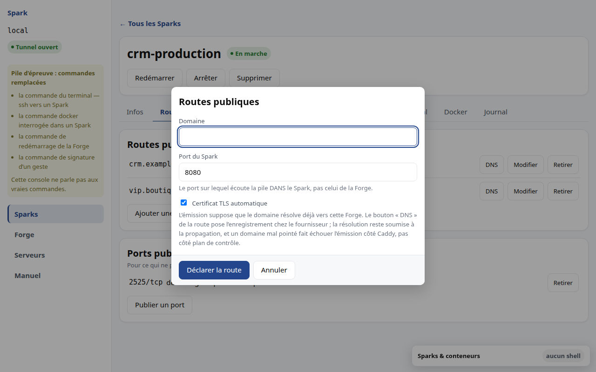

# M7 · Exposer un domaine

Le contrat est simple : **domaine → Spark → port**.

## Déclarer une route

Le port demandé est celui sur lequel écoute votre pile **dans le Spark**, pas
celui de l'hôte. C'est l'erreur la plus fréquente : on saisit `443` en croyant
décrire l'entrée.

Le TLS est confié à la gestion automatique du proxy. **L'émission d'un certificat
suppose que le domaine résolve déjà vers ce serveur.** Un domaine mal pointé
produit un échec d'émission côté proxy, pas une panne du plan de contrôle, et
l'interface ne présentera jamais un certificat comme « actif » : elle ne le sait
pas.

Pour faire résoudre le domaine, voir « Pointer le domaine » ci-dessous.

## Pointer le domaine

Chaque route porte un bouton **DNS**. Il ouvre une fenêtre qui lit les zones de
votre compte chez le fournisseur, et pose l'enregistrement qui fait résoudre ce
domaine vers votre serveur.

Le domaine n'est pas saisissable : il vient de la route. Le rendre modifiable
laisserait pointer un nom que le serveur ne route pas, c'est-à-dire un nom qui
répondrait « page introuvable ».

La zone la plus précise qui contienne le domaine est proposée d'avance. Si votre
compte porte à la fois `exemple.tech` et `staging.exemple.tech`, un domaine
`app.staging.exemple.tech` ira dans la seconde — écrit dans la première, il
serait invisible.

L'adresse demandée est celle du **serveur**, pas celle du Spark : un Spark vit
sur un réseau privé et n'a pas d'adresse publique. C'est le proxy qui répartit
ensuite par nom d'hôte.

Avant d'écrire, la fenêtre montre l'enregistrement exact qui partira, **et ce
qu'il va faire à ce qui est déjà en place** :

* « l'enregistrement sera posé » — rien n'occupe ce nom ;
* « il sera **remplacé** : *ancienne valeur* → *nouvelle valeur* » — la valeur
  remplacée est affichée, pas seulement annoncée ;
* « l'écrire ne changera rien » — la valeur en place est déjà la bonne.

Après, elle annonce ce qui a été **écrit** — jamais que le domaine est « prêt ».
La résolution demande le temps du délai d'expiration, et davantage si un
résolveur a déjà mis l'ancienne réponse en cache.

### Le domaine nu

`johndalia.com` sans sous-domaine est un cas ordinaire, et il fonctionne. La
fenêtre le signale — « il porte sur le domaine **nu** » — parce que le remplacer
déplace tout ce qui répond sur ce domaine, et pas seulement une de ses branches.

Vos serveurs de noms, votre messagerie et vos preuves de propriété ne sont **pas**
touchés : chaque écriture vise un nom *et un type* précis, et ceux-là sont d'un
autre type.

### Ce que ce bouton ne fera jamais

Il n'achète aucun domaine et n'en renouvelle aucun : une opération qui engage de
l'argent ne se déclenche pas depuis un écran d'administration. Il ne transfère
aucune zone et ne change aucun serveur de noms. Et il **ne supprime jamais** un
enregistrement qu'il n'a pas posé : votre zone porte de la messagerie et des
preuves de propriété, dont la disparition casserait des choses sans rapport avec
ce produit.

Deux écritures sont refusées, et le refus dit ce qu'il protège :

* un domaine qui n'est **pas dans** la zone choisie ;
* tout ce qui n'est pas une adresse IP.

### Si rien n'est configuré

Le jeton du fournisseur vit sur le **poste** qui fait tourner la console, dans un
fichier `.env` qui n'entre jamais dans le dépôt — jamais sur le serveur, où il
serait lisible par qui y détient l'administration. Sans jeton, la fenêtre le dit
et n'offre aucune saisie : ce n'est pas une panne, c'est une configuration
absente.

## Un domaine déjà pris

Deux Sparks ne peuvent pas revendiquer le même nom. Le refus vient de la base de
données, pas d'un contrôle de l'interface — qui ne protégerait de rien si deux
consoles agissaient en même temps.

## « Non appliquée »

Une route peut être enregistrée sans être servie : c'est ce qui arrive si le
proxy était injoignable au moment de la déclaration. L'interface l'affiche en
jaune, avec un bouton **Réappliquer**.

Le jaune est délibéré : rien n'est cassé, un état est simplement en retard.
Réappliquer ne détruit rien et ne demande donc aucune confirmation.

## Retirer

Le domaine cesse de répondre immédiatement. C'est réversible — il suffit de le
redéclarer — mais la confirmation nomme le domaine, parce que la coupure est
instantanée.

> **Limite connue.** L'émission d'un certificat n'a pas encore été éprouvée de
> bout en bout. La cause la plus fréquente de son échec — un domaine qui ne
> résout pas — est levée depuis que la console pose le DNS, mais l'émission
> elle-même reste à constater sur un serveur joignable depuis l'extérieur. Voir
> SPK-12 au [backlog](../BACKLOG.md).
