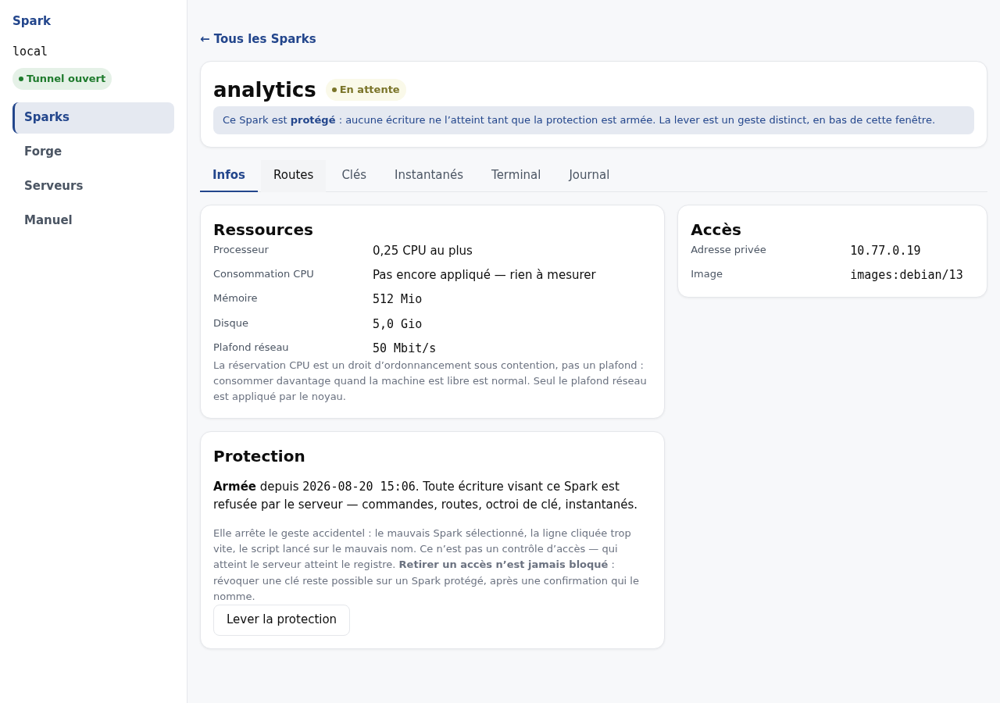
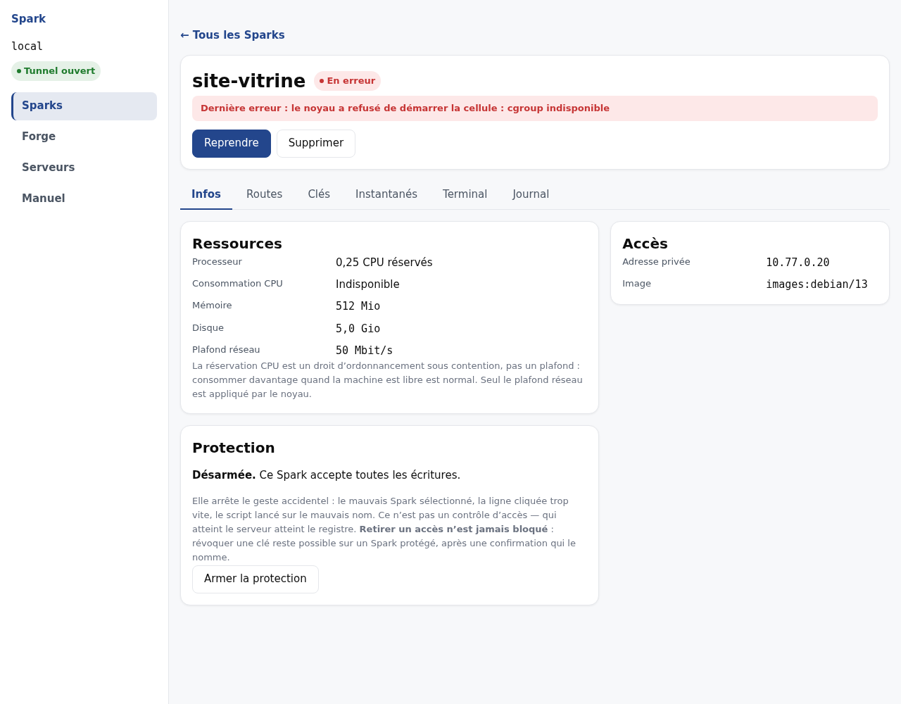
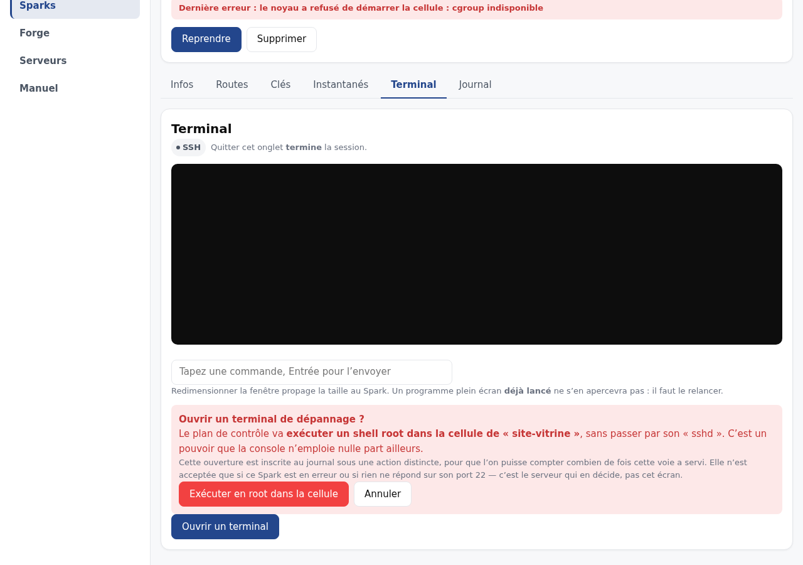

# M8 · Exploiter au quotidien

## Où trouver quoi

La fenêtre d'un Spark est découpée en **facettes**, chacune avec son propre
onglet :

| Onglet | Ce qu'on y lit |
|---|---|
| Infos | l'identité, les ressources, l'adresse privée |
| Routes | les domaines publics qui pointent vers ce Spark |
| Clés | les clés autorisées et la configuration SSH |
| Instantanés | les points de retour arrière |
| Terminal | un shell **dans** le Spark |
| Journal | ce qui s'est passé sur ce Spark |

Les commandes de cycle de vie — démarrer, arrêter, supprimer — restent
au-dessus des onglets : elles concernent le Spark entier, pas une de ses
facettes.

## Les commandes disponibles

L'écran détail n'affiche que les commandes **réellement acceptables** dans l'état
courant. Une commande impossible n'est pas grisée : elle n'est pas affichée. Un
bouton mort vous ferait essayer pour apprendre qu'il ne fait rien.

Quand une opération est en cours — création, démarrage, arrêt, suppression —
aucune commande n'est acceptée, et l'écran le dit en toutes lettres plutôt que
d'exposer des boutons sans effet.

## Protéger un Spark

Chaque Spark porte un **interrupteur de protection**. Tant qu'il est armé, le
serveur refuse toute écriture qui vise ce Spark : commandes de cycle de vie,
reconfiguration, routes publiques, octroi d'une clé, instantanés y compris leur
restauration. Les lectures, elles, ne sont jamais refusées.

Il s'arme avec un mot de passe, depuis la section **Protection** de la fenêtre du
Spark, et se lève avec ce même mot de passe. Réarmer accepte un mot de passe
différent : le produit ne retient pas l'ancien pour le proposer.

Lever la protection la **désarme durablement**, jusqu'à ce que vous la réarmiez.
Il n'y a pas de fenêtre de quelques minutes à surveiller : un déverrouillage
temporaire vous pousserait à travailler vite pour ne pas le rater, ce qui est
l'inverse du but. Un Spark désarmé le dit aussi clairement qu'un Spark protégé,
pour que l'oubli de réarmement se voie. Le badge, lui, suit le Spark jusque dans
la liste.

### Ce dont elle protège, et ce dont elle ne protège pas

Elle arrête le **geste accidentel** : le mauvais Spark sélectionné, la ligne
cliquée trop vite, la commande recopiée d'un autre bocal, le script d'astreinte
lancé sur le mauvais nom.

**Ce n'est pas un contrôle d'accès.** Qui atteint le serveur atteint le registre,
et pourra lever la protection sans mot de passe. Nous ne la présenterons jamais
autrement : la croire infranchissable serait plus dangereux que de ne pas l'avoir.

Elle est néanmoins appliquée par le **serveur** et pas seulement par cet écran —
sans quoi elle ne protégerait pas du cas le plus fréquent, qui est le script et
non l'humain.

### Il n'y a aucune récupération

Un mot de passe perdu ne se récupère pas depuis l'application. Il se lève sur le
serveur, en administrateur. C'est cohérent avec ce que la protection est : un
garde-fou, pas un chiffrement. Prétendre le contraire par un mécanisme de secours
compliqué reviendrait à mentir sur ce qu'elle vaut.

Il n'y a pas non plus de blocage après plusieurs essais ratés. Un compte à
rebours ne gênerait que vous : celui qu'il repousserait a déjà, par construction,
de quoi contourner la protection entière. Chaque tentative est en revanche
enregistrée au journal, réussie comme refusée — jamais le mot de passe lui-même.

### Retirer un accès n'est jamais bloqué

C'est l'exception, et elle est absolue. **Révoquer une clé reste possible sur un
Spark protégé.** Le jour où vous retirez l'accès d'une personne partie ou d'une
clé qui a fuité, un refus ne protégerait rien : il laisserait l'accès en place
parce qu'un interrupteur a été oublié ailleurs.

L'application ne refuse donc pas : elle vous **dit ce que vous touchez**. Elle
nomme les Sparks protégés concernés, un par un, et vous demande de confirmer. La
révocation aboutit ensuite **sans qu'aucune protection soit levée**, et aucun mot
de passe ne vous est demandé — exiger le secret de chaque Spark protégé pour
retirer une clé compromise reviendrait à refuser.

Le partage est simple : **ajouter** un accès à un Spark protégé se refuse,
**en retirer un** se confirme.

### Deux recalculs passent toujours

La redistribution des cœurs et la repondération des poids processeur traversent
un Spark protégé sans être bloquées. Elles n'altèrent ni sa configuration, ni son
état, ni ses données — et les bloquer ferait échouer la création d'un *autre*
Spark parce qu'un troisième est protégé.

## Lire les mesures

La consommation est affichée face à la réservation. Une consommation supérieure à
la réservation est un **burst**, pas un dépassement : elle apparaît en jaune, non
en rouge. Le rouge est réservé au dépassement d'un plafond, qui ne peut se
produire qu'en mode plafonné.

Quand il n'y a rien à mesurer, l'interface le dit plutôt que d'afficher un blanc
ou un zéro trompeur :

| Situation | Ce qui s'affiche |
|---|---|
| Spark arrêté | « Arrêté — aucune mesure d'exécution » |
| Spark déclaré, jamais appliqué | « Pas encore appliqué — rien à mesurer » |
| premier relevé en cours | « Mesure en cours » |
| Spark en erreur | « Indisponible » |
| consommation réellement nulle | `0` |

## Comprendre un Spark en erreur

Un Spark en erreur affiche **la cause réelle**, pas un message générique, et
propose **Reprendre**. Le journal, en bas de l'écran, retrace les transitions et
les opérations, avec leur résultat : réussi, refusé ou en erreur.

## Le terminal

L'onglet **Terminal** ouvre un shell dans le Spark. C'est votre poste qui s'y
connecte, avec votre clé — le serveur qui gère les Sparks n'est pas sur ce
chemin, et il n'apprend rien de ce que vous y faites.

Autrement dit : la console vous épargne les gestes, pas les droits. Elle fait ce
que vous feriez avec un terminal et votre clé.

### Ouvrir, écrire, quitter

Le bouton **Ouvrir un terminal** démarre la session. Tapez votre commande dans le
champ, `Entrée` l'envoie.

**Quitter l'onglet termine la session** — c'est écrit à l'écran, et c'est
délibéré : une session qui survivrait à sa fenêtre serait un shell administrateur
abandonné dont plus personne ne se souvient. Fermer l'onglet du navigateur a le
même effet.

Une session laissée sans activité se ferme aussi, **après un avertissement**
affiché avant la coupure. Une touche suffit à la conserver.

### Ce que le journal retient

L'ouverture et la fermeture, avec leur durée. **Rien de ce que vous tapez**, et
rien de ce qui s'affiche.

Ce n'est pas un oubli. Le caviardage du journal travaille sur des champs nommés ;
il ne saurait pas nettoyer un flux où un mot de passe est tapé au milieu d'une
ligne. Enregistrer les frappes reviendrait à créer un dépôt de secrets en clair.

**Conséquence à connaître** : le journal dira qu'une session a eu lieu, jamais ce
qui y a été fait. Si vous voulez cette trace-là, elle doit venir de l'intérieur
du Spark.

### Ce qui peut manquer

**Un Spark déclaré mais jamais créé** n'a pas de cellule où se connecter. Ses
ressources sont réservées et son adresse attribuée, mais rien ne tourne encore :
l'écran vous le dit au lieu d'afficher une erreur technique.

### Quand rien ne répond : le terminal de dépannage

Il arrive qu'un Spark tourne et que le chemin normal ne mène nulle part : son
serveur SSH n'est pas installé, il s'est arrêté, ou le Spark est en erreur. Le
bouton **Terminal de dépannage** existe pour ce cas-là, et pour lui seul.

Ce chemin ne passe pas par le Spark : **la console demande au serveur qui gère
les Sparks d'exécuter un shell root à l'intérieur de la cellule.** C'est un
pouvoir qu'elle n'emploie nulle part ailleurs — partout ailleurs, elle fait ce
que vous feriez avec votre clé, et rien de plus. C'est pourquoi elle vous le
demande en le nommant, plutôt que de vous faire cliquer « confirmer ».

**Le serveur décide, pas l'écran.** Vous pouvez toujours demander ce chemin ; il
n'est accordé que si le Spark est en erreur ou si rien ne répond sur son port
22. Sinon vous recevez un refus qui dit pourquoi, et le chemin normal reste à
côté, toujours disponible.

Un cas mérite d'être distingué, parce qu'il ressemble au précédent sans l'être :
**si le serveur SSH du Spark répond mais refuse votre clé**, le dépannage n'est
pas la réponse. C'est un problème d'accès, et il se règle depuis l'onglet
**Clés** ([M6](M6-acces.md)). L'écran vous le dit ainsi.

Pendant toute la session de dépannage, une **bannière rouge** rappelle par quel
chemin vous êtes entré et pourquoi. Elle ne disparaît pas, y compris après la fin
du shell distant — c'est précisément le moment où on l'oublierait.

**Ces ouvertures se comptent.** Elles sont inscrites au journal sous une entrée
distincte de celle d'une session normale, de sorte qu'un relevé montre combien de
fois cette voie a servi. Une voie d'exception qu'on ne peut pas compter cesse
d'en être une.

### Confort et accessibilité

Le **mode lecteur d'écran** fait annoncer la sortie par une synthèse vocale. Un
terminal s'utilise au clavier par construction, mais il n'est pas *lisible* par
défaut. Le réglage est retenu pour la durée de votre visite.

Redimensionner la fenêtre propage la taille au Spark. Attention : un programme
plein écran **déjà lancé** ne s'en apercevra pas — il faut le relancer.

> **Limite connue.** Le fait que la connexion atteigne réellement un Spark n'a
> pas encore été constaté sur une Forge réelle : cela demande une machine avec
> Incus et un serveur SSH installé dans le Spark. L'image de base n'en embarque
> pas.
