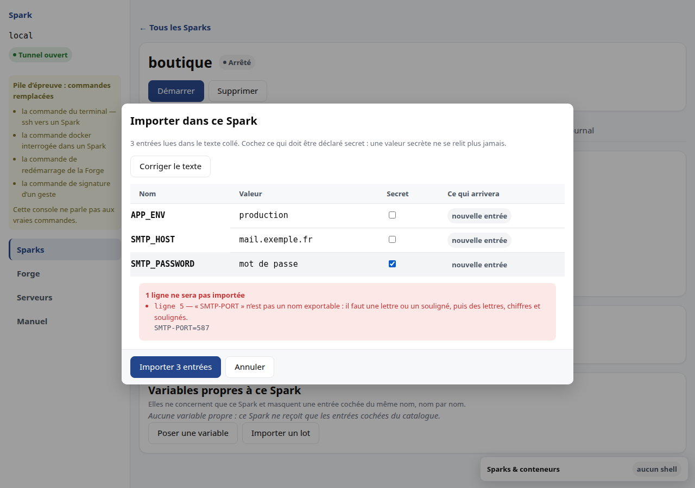
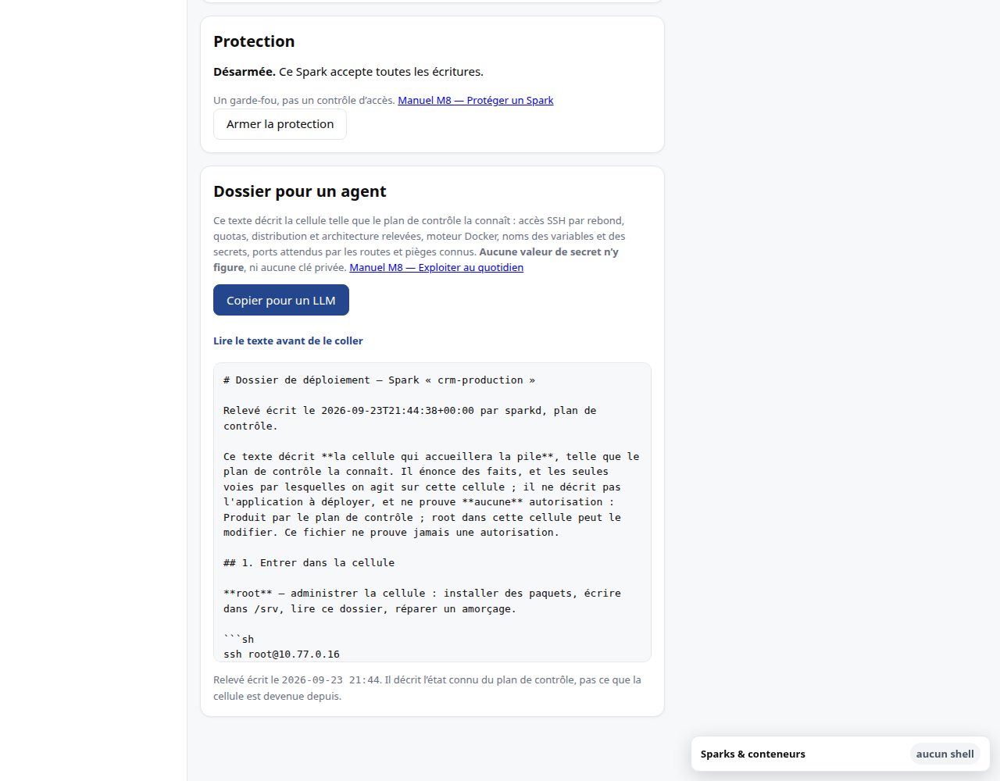
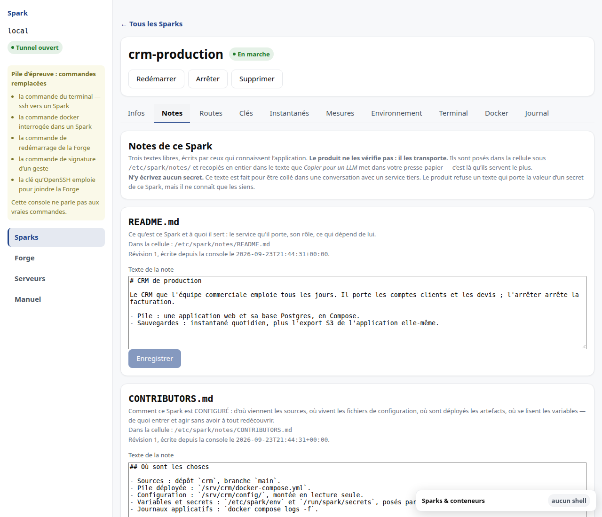
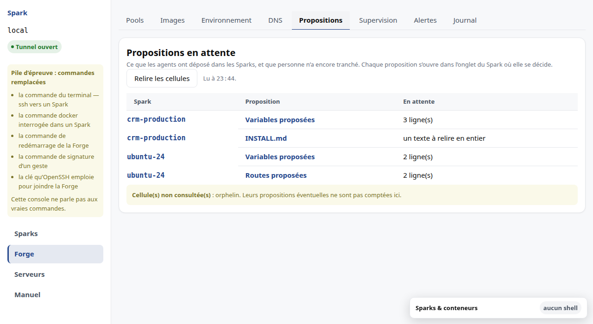
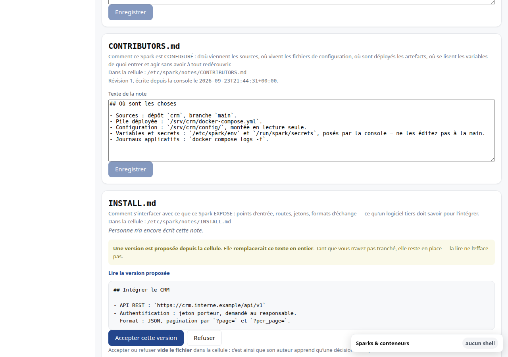
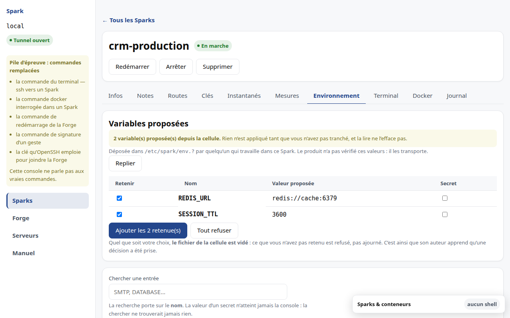
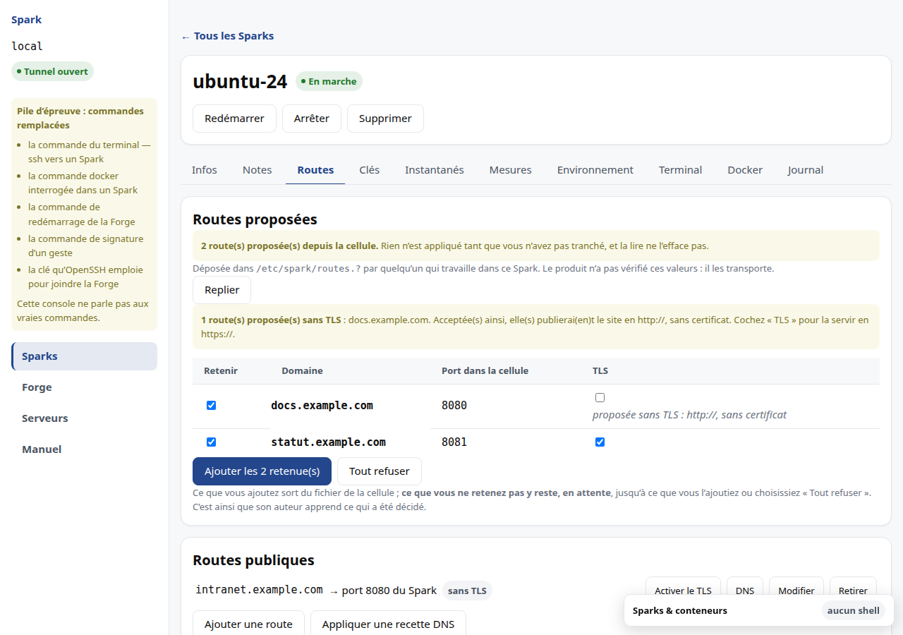
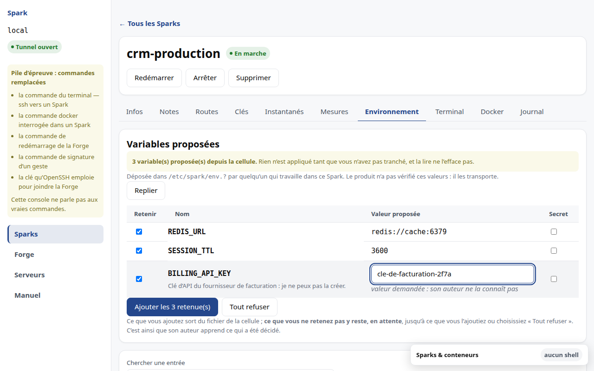
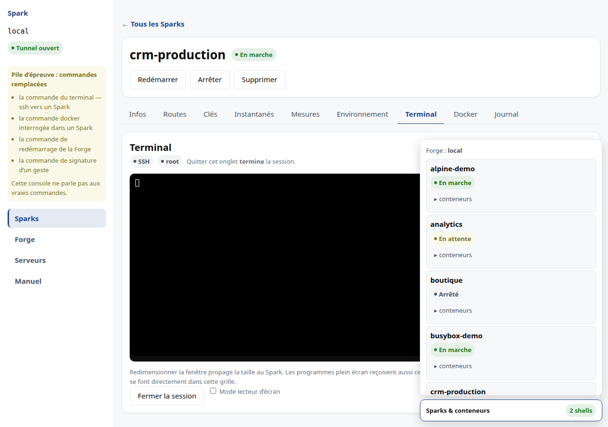

# M8 · Exploiter au quotidien

## Où trouver quoi

La fenêtre d'un Spark est découpée en **facettes**, chacune avec son propre
onglet :

| Onglet | Ce qu'on y lit |
|---|---|
| Infos | l'identité, les ressources, les projets où il est rangé, l'adresse privée, l'amorçage et le dossier pour un agent |
| Routes | les domaines publics qui pointent vers ce Spark |
| Clés | les clés autorisées et la configuration SSH |
| Instantanés | les points de retour arrière |
| Mesures | les courbes de consommation de ce Spark, face à ses quotas |
| Terminal | un shell **dans** le Spark |
| Journal | ce qui s'est passé sur ce Spark |

Les commandes de cycle de vie — démarrer, arrêter, supprimer — restent
au-dessus des onglets : elles concernent le Spark entier, pas une de ses
facettes.

## Mettre à jour le plan de contrôle

Avant une opération d'exploitation, ouvrez **Forge → Code déployé**. *À jour*
est un constat mesuré, pas une valeur par défaut. Si la Forge est *En retard* et
que son commit est un ancêtre sûr du vôtre, **Mettre à jour `sparkd`** apparaît.
Les autres verdicts expliquent l'écart sans offrir de bouton.

Le geste interrompt brièvement l'API, mais pas les Sparks. Attendez le bloc vert
**Mise à jour prouvée** : il signifie que le paquet, les unités, le
`daemon-reload`, le redémarrage, les deux sondes et la build concordent. Si une
phase échoue, gardez le compte rendu affiché ; il sépare la panne initiale de la
tentative automatique de retour arrière.

Après un succès, le retour à la build précédente reste disponible tant que la
console est ouverte et que la Forge sert toujours la build attendue. Il est
utile pour une régression applicative immédiate ; ce n'est pas un retour arrière
des données. Les deux gestes sont inscrits dans le journal de la Forge avec les
empreintes avant/après, jamais avec la sortie de pip.

### Revenir en arrière rétablit AUSSI le registre

Chaque mise à jour **sauvegarde le registre de `sparkd`** juste avant de toucher
à quoi que ce soit. Si la sauvegarde ne peut pas être prise, la mise à jour
s'arrête là : rien n'est installé, votre Forge continue de servir ce qu'elle
servait.

C'est cette sauvegarde que « Revenir à la build précédente » restaure. Le geste
ramène donc **tout** — le code et l'état du plan de contrôle — à l'instant qui
précédait la mise à jour, et **l'écran vous annonce cette date** avant que vous
n'engagiez quoi que ce soit.

**Ce qui sera perdu**, et l'écran l'énumère : les Sparks déclarés depuis, leurs
quotas, les routes, les ports publiés, les clés autorisées, l'environnement, et
le journal d'audit. Le journal raccourcira, et la supervision le signalera au
relevé suivant — c'est normal, et c'est exact.

**Ce qui n'est pas concerné** : les **cellules**. Vos Sparks continuent de
tourner pendant et après le geste, et leurs **instantanés** (voir
[M9](M9-instantanes.md)) ne sont pas touchés — ce sont deux mécanismes différents
qui portent le même mot. Une cellule créée après la date rétablie existera
toujours sur la machine, sans que le registre la connaisse ; l'écran des Sparks
vous la montrera comme telle.

Le registre remplacé n'est pas effacé : il est conservé à côté, daté. Un retour
arrière malheureux se rattrape.

### Une mise à jour plus ancienne

Une mise à jour conduite avant cette évolution n'a pas laissé de sauvegarde.
L'écran vous le dit : le retour arrière ne rétablira alors que le **code**. Et si
cette mise à jour avait fait évoluer le schéma du registre, l'ancienne build
**refusera de le servir** — elle ne démarrera pas. Dans ce cas, mieux vaut
avancer et corriger dans une build suivante ; la reprise manuelle est décrite au
contrat de déploiement.

## Les commandes disponibles

L'écran détail n'affiche que les commandes **réellement acceptables** dans l'état
courant. Une commande impossible n'est pas grisée : elle n'est pas affichée. Un
bouton mort vous ferait essayer pour apprendre qu'il ne fait rien.

Quand une opération est en cours — création, démarrage, arrêt, suppression —
aucune commande n'est acceptée, et l'écran le dit en toutes lettres plutôt que
d'exposer des boutons sans effet.

## Protéger un Spark

Chaque Spark porte un **interrupteur de protection**. Tant qu'il est armé, le
serveur refuse toute écriture qui vise ce Spark : commandes de cycle de vie,
reconfiguration, routes publiques, octroi d'une clé, instantanés y compris leur
restauration. Les lectures, elles, ne sont jamais refusées.


Il s'arme avec un mot de passe, depuis la section **Protection** de la fenêtre du
Spark, et se lève avec ce même mot de passe. Réarmer accepte un mot de passe
différent : le produit ne retient pas l'ancien pour le proposer.

Lever la protection la **désarme durablement**, jusqu'à ce que vous la réarmiez.
Il n'y a pas de fenêtre de quelques minutes à surveiller : un déverrouillage
temporaire vous pousserait à travailler vite pour ne pas le rater, ce qui est
l'inverse du but. Un Spark désarmé le dit aussi clairement qu'un Spark protégé,
pour que l'oubli de réarmement se voie. Le badge, lui, suit le Spark jusque dans
la liste.

### Ce dont elle protège, et ce dont elle ne protège pas

Elle arrête le **geste accidentel** : le mauvais Spark sélectionné, la ligne
cliquée trop vite, la commande recopiée d'un autre bocal, le script d'astreinte
lancé sur le mauvais nom.

**Ce n'est pas un contrôle d'accès.** Qui atteint le serveur atteint le registre,
et pourra lever la protection sans mot de passe. Nous ne la présenterons jamais
autrement : la croire infranchissable serait plus dangereux que de ne pas l'avoir.

Elle est néanmoins appliquée par le **serveur** et pas seulement par cet écran —
sans quoi elle ne protégerait pas du cas le plus fréquent, qui est le script et
non l'humain.

### Il n'y a aucune récupération

Un mot de passe perdu ne se récupère pas depuis l'application. Il se lève sur le
serveur, en administrateur. C'est cohérent avec ce que la protection est : un
garde-fou, pas un chiffrement. Prétendre le contraire par un mécanisme de secours
compliqué reviendrait à mentir sur ce qu'elle vaut.

Il n'y a pas non plus de blocage après plusieurs essais ratés. Un compte à
rebours ne gênerait que vous : celui qu'il repousserait a déjà, par construction,
de quoi contourner la protection entière. Chaque tentative est en revanche
enregistrée au journal, réussie comme refusée — jamais le mot de passe lui-même.

**Une réserve sur cette phrase, et elle compte.** « Chaque tentative » désigne
celles qui passent par le produit. La levée faite **sur le serveur**, elle, n'est
pas une tentative : c'est une écriture directe au registre, et le produit ne la
voit pas passer. Elle ne laisse donc **aucune trace**, sauf si la personne qui
l'exécute en inscrit une elle-même. La marche à suivre le prévoit — voir
`docs/CONTINGENCE.md` §5 —, mais rien ne l'y oblige. Autrement dit : le seul
geste capable de défaire une protection est aussi le seul que le journal ne
rapporte pas de lui-même.

### Retirer un accès n'est jamais bloqué

C'est l'exception, et elle est absolue. **Révoquer une clé reste possible sur un
Spark protégé.** Le jour où vous retirez l'accès d'une personne partie ou d'une
clé qui a fuité, un refus ne protégerait rien : il laisserait l'accès en place
parce qu'un interrupteur a été oublié ailleurs.

L'application ne refuse donc pas : elle vous **dit ce que vous touchez**. Elle
nomme les Sparks protégés concernés, un par un, et vous demande de confirmer. La
révocation aboutit ensuite **sans qu'aucune protection soit levée**, et aucun mot
de passe ne vous est demandé — exiger le secret de chaque Spark protégé pour
retirer une clé compromise reviendrait à refuser.

Le partage est simple : **ajouter** un accès à un Spark protégé se refuse,
**en retirer un** se confirme.

### Deux recalculs passent toujours

La redistribution des cœurs et la repondération des poids processeur traversent
un Spark protégé sans être bloquées. Elles n'altèrent ni sa configuration, ni son
état, ni ses données — et les bloquer ferait échouer la création d'un *autre*
Spark parce qu'un troisième est protégé.

## Rattraper les cellules créées avant l'isolation

Chaque Spark **naît** isolé du réseau des autres : il n'y a rien à choisir, ni
Spark par Spark, ni à la création. Seules les cellules créées **avant** cette
règle ne le sont pas encore. Depuis l'écran *Forge*, la section *Isolation du
réseau* les compte et les **nomme** ; le geste *Les isoler maintenant* les
rattrape toutes d'un coup, à chaud, sans redémarrage, après une confirmation qui
nomme les cellules concernées.

Ce que le rattrapage rend, et ce que ça veut dire :

- **isolées : …** — ces cellules viennent d'être isolées, une ligne de journal
  chacune ;
- **déjà isolées : n** — celles-là l'étaient ; elles ne sont ni touchées ni
  journalisées ;
- **refusées, protégées : …** — un Spark protégé refuse toute écriture qui le
  vise (voir *Protéger un Spark*). Il reste non isolé, et l'écran continue de le
  nommer, jusqu'à ce que vous leviez sa protection et rejouiez le geste ;
- **en échec : …** — une cellule absente, ou un pilote qui n'a pas répondu, avec
  la raison. Les autres ont été traitées quand même.

Quand plus aucune cellule ne précède la règle, le geste disparaît : il n'a plus
d'objet, et la section dit « toutes les cellules sont isolées ». Un état « non
relevée » n'est pas « non isolé » : la console n'a pas pu lire Incus, et elle le
dit plutôt que de deviner.

## Lire les mesures

La consommation est affichée face à la réservation. Une consommation supérieure à
la réservation est un **burst**, pas un dépassement : elle apparaît en jaune, non
en rouge. Le rouge est réservé au dépassement d'un plafond, qui ne peut se
produire qu'en mode plafonné.

Quand il n'y a rien à mesurer, l'interface le dit plutôt que d'afficher un blanc
ou un zéro trompeur :

| Situation | Ce qui s'affiche |
|---|---|
| Spark arrêté | « Arrêté — aucune mesure d'exécution » |
| Spark déclaré, jamais appliqué | « Pas encore appliqué — rien à mesurer » |
| premier relevé en cours | « Mesure en cours » |
| Spark en erreur | « Indisponible » |
| consommation réellement nulle | `0` |

## Suivre la consommation dans le temps

Les mesures ci-dessus disent ce que consomme un Spark **maintenant**. Elles ne
répondent pas à « a-t-il toujours consommé autant », ni à « qui a saturé la
Forge cette nuit ». Pour cela, la Forge **relève l'usage en continu** et le
conserve.

Deux écrans, selon ce que vous regardez :

- **Forge → Supervision** : la somme de ce que consomment tous les Sparks, et
  une ligne par Spark en dessous. C'est la Forge que vous regardez ;
- **la facette Mesures d'un Spark** : les mêmes quatre ressources, pour ce Spark
  seul, comparées à **ses** quotas.

Les deux offrent les mêmes périodes : 15 minutes, 1 heure, 6 heures, 24 heures,
7 jours. La période choisie reste dans l'adresse : vous pouvez recharger la page,
ou envoyer le lien, et retrouver la même.

**Le pas de temps est écrit sous la période** : « 1 h — un point toutes les
15 s ». Un point d'une courbe sur 7 jours n'est pas une mesure, c'est la
**moyenne** des relevés de son intervalle — l'écran dit combien il en a groupés
quand vous parcourez la courbe.

### Lire une courbe

Passez la souris dessus, ou donnez-lui le focus au clavier et employez les
flèches : la valeur du point visé s'affiche sous le tracé. Le repère vaut pour
**les quatre courbes à la fois**, pour que vous compariez le même instant.
`Origine` et `Fin` mènent aux deux bouts, `Échap` retire le repère.

### Un trou dans une courbe

Une courbe **ne relie jamais** deux points séparés par un trou : tracer une
droite affirmerait une consommation que personne n'a mesurée. Il y a deux
raisons possibles à un trou, et elles ne disent pas la même chose :

| Ce qui s'affiche | Ce que cela veut dire |
|---|---|
| « Arrêté — aucune mesure d'exécution » | le Spark ne tournait pas |
| « Aucun relevé sur cette période » | personne n'a relevé — la Forge redémarrait, ou son plan de contrôle était arrêté |
| « Supervision désactivée sur cette Forge » | le relevé continu est éteint dans la configuration de la Forge |

Le troisième cas n'est pas une panne : c'est un réglage. Une Forge peut très
bien fonctionner sans conserver ses mesures.

### La ligne pointillée

Chaque courbe porte la valeur à laquelle elle se compare, en pointillés et
nommée dans la légende : la réservation ou le plafond pour un Spark, la capacité
du pool pour la Forge. Pour le réseau, c'est toujours le **plafond** — la
réservation est une grandeur de comptabilité, que le noyau n'applique pas.

Quand cette valeur est très supérieure à ce qui est consommé — un Spark qui
utilise 2 Mbit/s sous un plafond de 100 —, la ligne n'est pas tracée : elle
écraserait la courbe au ras du sol. La légende l'indique alors par
« (hors du cadre) », et sa valeur reste écrite.

### Ce que la supervision ne fait pas

- elle **n'alerte pas**. Aucun seuil, aucune notification : c'est une lecture ;
- elle **ne remonte pas le passé**. Un Spark créé ce matin n'a pas de courbe
  d'hier, et une Forge qui vient d'être mise à jour repart d'un historique vide
  sur la période où elle était arrêtée ;
- elle **ne mesure pas la Forge elle-même**. La somme est celle des Sparks : ni
  le plan de contrôle, ni Incus, ni le proxy n'y figurent ;
- elle **ne suit pas les conteneurs Docker**. Ces mesures-là viennent de
  l'intérieur de la cellule et se comparent à autre chose ; elles vivent dans
  l'onglet *Docker*.

L'historique est conservé **7 jours** par défaut, et un relevé est pris toutes
les **15 secondes**. Les deux se règlent sur la Forge.

## Changer les quotas d'un Spark

Un Spark trop petit — ou trop grand — se **redimensionne**. Il n'y a pas à le
supprimer ni à le recréer : la cellule, ses images Docker, ses volumes et sa
configuration restent en place.

**Infos → Ressources → Modifier les quotas.** La fenêtre s'ouvre déjà remplie
des valeurs actuelles ; vous changez celles que vous voulez changer, et rien
d'autre.

Quatre réglages se changent : le **mode CPU**, la **mémoire**, le **disque** et
le **plafond réseau**.

Le mode CPU décide de ce que vous réglez ensuite — une réservation en mode
partagé, un plafond en mode plafonné, un nombre de cœurs en mode dédié. Changer
de mode change donc le champ qui suit, et les réglages de l'ancien mode ne
survivent pas : une réservation sur un Spark plafonné serait une valeur que rien
n'emploie.

### Tout est pris en compte immédiatement

Les quatre réglages prennent effet **sans redémarrer** votre Spark — mesuré sur
la Forge de validation le 2026-08-21, disque et mode CPU compris. La fenêtre le
dit sous chaque champ.

Le manuel a longtemps annoncé l'inverse pour le disque et le mode CPU : tant que
la prise à chaud n'avait pas été mesurée, le produit promettait **moins** que ce
qu'il tient. C'est le bon sens de l'erreur — annoncer un redémarrage qui n'a pas
lieu ne coupe rien, l'inverse coupe un service.

### Ce que vous retirez doit être libre

Réduire un quota sous ce qui est réellement employé est **refusé**, et le refus
dit lequel des deux cas s'est produit :

| Le message parle de… | Ce qu'il faut faire |
|---|---|
| **capacité insuffisante** sur la Forge | libérer de la place sur le serveur, ou demander moins |
| ce que la **cellule emploie** ou **contient** | libérer de la mémoire ou du disque **dans le Spark**, puis recommencer |

Les deux ne se confondent pas, et c'est important : le premier se règle sur la
Forge, le second dans votre Spark. Un message qui les mélangerait vous enverrait
chercher au mauvais endroit.

Deux précisions sur le chiffre que le refus vous annonce :

- **l'occupation du disque compte vos instantanés.** Elle peut donc dépasser
  largement la taille de vos fichiers. Supprimer un instantané devenu inutile
  rend de la place aussi sûrement que supprimer des fichiers ;
- **la mémoire n'est comptée que sur un Spark en marche.** Sur un Spark arrêté,
  elle n'est pas mesurée, et sa réduction n'est donc pas refusée à ce titre.

### Un Spark protégé ne se redimensionne pas

Le bouton reste visible, **désactivé**, avec sa raison. Levez la protection
d'abord (voir plus haut) : c'est un geste distinct, et il doit le rester.

## Passer des variables à votre pile

**Forge → onglet Environnement.** La Forge tient un **catalogue** : vous y
définissez une valeur une seule fois, mais elle ne descend dans aucun Spark à ce
stade. La ligne dit combien de Sparks l'ont sélectionnée ; « Ne descend nulle
part » est un état normal, pas une erreur.

**Infos → onglet Environnement du Spark.** Cochez les entrées du catalogue que
ce Spark doit recevoir. Décocher retire l'entrée de la cellule ; aucun autre
Spark n'est modifié. Ajouter une nouvelle entrée au catalogue ne change donc
jamais une pile existante par surprise.

Sous les cases, les entrées sélectionnées et les variables **propres à ce Spark**
restent distinctes. Vous pouvez poser une valeur propre sans la déclarer pour les
autres Sparks.

Chaque ligne dit **d'où vient sa valeur** :

| Ce que la colonne indique | Ce que cela veut dire |
|---|---|
| **Cochée au catalogue** | définie dans le catalogue de la Forge et sélectionnée pour ce Spark |
| **Propre à ce Spark** | posée ici, et nulle part ailleurs |
| **Masque une entrée cochée** | posée aux deux niveaux ; c'est celle du Spark qui s'applique |

Sans cette colonne, on lit une valeur sans pouvoir dire pourquoi elle est
celle-là — et on va la corriger au mauvais endroit.

La **surcharge se fait nom par nom** : remplacer `SMTP_HOST` sur un Spark ne lui
fait pas perdre le `SMTP_PORT` également coché pour ce Spark.

### Les variables et les secrets ont chacun leur bloc

Dans chaque section, les **variables** et les **secrets** sont deux blocs
séparés, et chaque titre porte son compte. La facette d'un Spark en montre donc
quatre — variables et secrets **cochés au catalogue**, puis variables et secrets
**propres au Spark** —, et le catalogue de la Forge en montre deux.

Ce n'est pas qu'une mise en page : les deux ne se lisent pas pour la même raison.
Une variable se lit pour sa **valeur**. Un secret n'en a pas de lisible : il se
lit pour son **existence** — posé ou non, depuis quand, et la même valeur
qu'ailleurs ou non. Le compte du bloc *Secrets* répond d'un coup d'œil à la
question qu'on se pose avant d'ouvrir un accès : **combien de secrets cette
cellule reçoit-elle, et lesquels ?**

Un bloc vide vous dit lequel manque. « Aucun secret » n'est pas la même
information que « aucune entrée » : le premier vous dit que la cellule n'en
reçoit aucun, le second qu'elle ne reçoit rien du tout.

### Chercher une entrée

Le champ **Chercher une entrée**, en haut de la vue, restreint tout ce qu'elle
affiche : les blocs, et aussi les cases à cocher du catalogue. Vous n'avez donc
pas à savoir d'avance dans quel bloc vit le nom que vous cherchez.

**La recherche porte sur le nom**, et le champ vous le rappelle. Elle ne regarde
pas les valeurs, et ce n'est pas un oubli : la console n'a jamais la valeur d'un
secret, si bien qu'une recherche par la valeur ne trouverait **jamais** un
secret. Elle vous répondrait « aucun résultat » sur une entrée qui existe, sans
que rien ne vous le signale.

Chercher ne change rien : rien n'est coché, décoché ni retiré. Une entrée que la
recherche masque **descend toujours** dans la cellule. Videz le champ et elle
revient ; le champ reste d'ailleurs à sa place même lorsqu'il ne reste plus rien
à l'écran, puisque c'est par lui qu'on en sort.

### Importer un fichier `.env` en une fois

Une pile de locataire arrive rarement avec deux variables : son `.env` en porte
souvent vingt ou quarante. Le bouton **Importer un lot** — au catalogue de la
Forge comme sur la facette d'un Spark — ouvre une zone où vous **collez le texte
tel quel**.

Le format est celui d'un fichier `.env` :

```
# une ligne de commentaire est ignorée
SMTP_HOST=mail.exemple.fr
export SMTP_PORT=587
SMTP_PASSWORD="une valeur entre guillemets"
```

`export` est toléré, les lignes vides et celles qui commencent par `#` sont
ignorées, et une valeur peut être entre guillemets simples ou doubles.

**Rien n'est écrit quand vous cliquez « Analyser ».** L'écran vous montre d'abord,
ligne par ligne, ce qu'il a lu :



| Ce que la colonne dit | Ce que cela veut dire |
|---|---|
| **nouvelle entrée** | ce nom n'existe pas encore ici |
| **remplace la valeur actuelle** | ce nom existe déjà : sa valeur sera écrasée |
| **masque une entrée cochée** | sur un Spark, ce nom vient du catalogue ; la valeur importée passera devant |

Cochez la case **Secret** de chaque ligne qui doit en être une. Le produit n'en
coche aucune de lui-même : un nom ne dit pas ce qu'il porte, et `DATABASE_URL`
contient un mot de passe une fois sur deux.

**Une ligne de commentaire collée juste au-dessus d'une variable se lit sous son
nom.** C'est l'usage habituel d'un `.env` — on écrit ce à quoi sert la ligne
au-dessus d'elle — et l'écran vous le rend plutôt que de le jeter. Une seule
ligne, la plus proche, 120 caractères. Elle n'est pas écrite dans le Spark :
elle explique la variable, elle n'en fait pas partie.

Trois choses ne sont **jamais** devinées, et le refus vous le dit avec le numéro
de la ligne concernée :

- une ligne **sans `=`** ne définit rien ;
- un **nom hors grammaire** — un tiret, un chiffre en tête — n'est pas exportable ;
- une **valeur sur plusieurs lignes** n'est pas prise en charge. Un guillemet
  ouvert et non refermé sur la même ligne est refusé plutôt que coupé en
  silence : écrivez `\n` là où il faut un saut de ligne.

Si le même nom apparaît deux fois, c'est la **dernière** ligne qui l'emporte,
comme dans un shell, et l'écran vous dit laquelle a été supplantée.

Un `#` au milieu d'une ligne appartient à la valeur : un mot de passe ne perd
jamais sa moitié droite.

Le bouton final porte le **compte** : « Importer 3 entrées ». Le lot passe alors
en entier ou pas du tout — un import à moitié posé ferait démarrer une pile à
moitié configurée. L'import n'enlève rien : ce que le texte ne mentionne pas
reste en place.

**Importer au catalogue de la Forge ne distribue rien**, exactement comme
« Ajouter une entrée » : chaque Spark coche ensuite ce qu'il reçoit. Et si l'une
des entrées importées descend déjà dans un Spark **protégé**, la console vous le
dit et vous demande de confirmer avant d'écrire ; aucune protection n'est levée.

### Une valeur secrète ne se relit pas

Cochez « Déclarer cette valeur secrète » et la valeur devient invisible, pour de
bon : l'écran n'en montrera plus que le **nom**, une **empreinte** et la date du
dernier changement. Elle n'est plus rendue par l'API, ni portée au journal.

L'empreinte sert à répondre à « est-ce la même valeur que sur l'autre Spark ? »
sans la montrer. Elle ne se compare qu'**entre Sparks de la même Forge**.

Il n'existe aucun moyen de la révéler. On la **remplace**, ou on la retire.

**Ce que cela ne protège pas** : la valeur arrive en clair dans votre Spark —
c'est le but, votre application doit pouvoir l'employer — et qui détient les
droits d'administration sur la Forge peut la lire. Ce qui est protégé, c'est
l'affichage accidentel, le journal, l'API et les exports.

### Écrire ne redémarre rien

La pile du locataire lira la nouvelle valeur à son **prochain démarrage**.
L'écran le dit avant que vous n'agissiez, plutôt que de laisser croire à un effet
immédiat. Le locataire attache les fichiers à ses services comme le décrit
[M6](M6-acces.md).

### Un Spark protégé, et la Forge

Sur un Spark protégé, le bouton et les cases restent visibles, **désactivés** :
levez la protection d'abord. Au niveau de la **Forge**, une écriture qui touche
un Spark protégé le **nomme** et vous demande de confirmer ; aucune protection
n'est levée. Refuser sèchement gèlerait toute la Forge dès qu'un seul Spark est
protégé, et l'on finirait par lever les protections pour contourner.

## Donner à un agent de quoi préparer le déploiement



**Infos → Dossier pour un agent.** Le bouton **Copier pour un LLM** met dans le
presse-papier un texte décrivant la cellule. Vous le collez à l'agent — ou à la
personne — qui prépare le déploiement sur son propre dépôt, avant même de se
connecter au Spark.

Ce texte répond aux questions qu'on découvre autrement à l'usage, une à une :

| Ce qu'il contient | Ce que cela évite |
|---|---|
| la commande SSH complète, rebond compris | chercher pourquoi l'adresse publique de la Forge ne mène nulle part |
| les empreintes des clés autorisées | croire à une panne réseau quand c'est un accès qui manque |
| la distribution, sa suite et l'**architecture** relevées | tirer une image pour la mauvaise architecture |
| les versions de Docker et du greffon Compose, et le mode | parler au mauvais socket en rootless |
| les quotas et ce qu'ils veulent dire | dimensionner sur `nproc` et `free`, qui décrivent la Forge |
| les **noms** des variables et des secrets, et leurs deux chemins | déployer une pile à qui aucune variable n'arrive |
| le **port que chaque route publique attend** dans la cellule | un domaine qui rend `502` alors que tout paraît sain |
| **le chemin** d'une route : TLS terminé par la Forge, pile en clair, aucun port publié requis | faire demander un port publié, et un routage, pour un service web qui n'en a pas besoin |
| **une route que le mode rootless ne peut pas servir** | bâtir une pile autour d'un port que la cellule n'ouvrira jamais |
| les ports publiés, et les pièges connus | réinstaller Docker depuis la distribution, et casser la cellule |
| le chemin du briefing posé dans la cellule, **et la ligne qui le lit sans ouvrir de shell** | entrer par `ssh hôte 'commande'`, ne voir aucun panneau d'accueil, et ignorer que ce fichier existe |
| **la seule voie par laquelle une variable entre**, et la forme du bloc à vous rendre | une variable écrite à la main dans la cellule, effacée à la prochaine écriture du plan de contrôle |
| **l'origine publique** de chaque route — `https://…` ou `http://…` | une application qui émet des URL en `http://` derrière un terminateur TLS |
| ce que l'ingress transmet, et ce qu'il **n'ajoute pas** | ajouter un proxy dans la pile pour des protections qu'il ne donnera pas |
| que le plan de contrôle **ne filtre aucun port sortant** | chercher chez nous un blocage qui vient de l'hébergeur |
| les **trois notes** du Spark, recopiées en entier | redécouvrir à quoi sert ce Spark, comment il est configuré et comment s'y interfacer |
| **le fichier `.?`** par lequel l'agent propose une variable, un secret, une route ou une note | un agent qui écrit dans les fichiers du plan de contrôle, et dont le travail disparaît à la prochaine écriture |

**Aucune valeur de secret n'y figure**, ni aucune clé privée — seulement leurs
noms et les fichiers où la pile les lira. C'est délibéré : ce texte est fait pour
être collé dans une conversation avec un service tiers, et c'est exactement le
trajet qu'un secret ne doit pas faire.

**Lisez-le avant de le coller.** « Lire le texte avant de le coller » déplie le
contenu exact ; rien n'est envoyé nulle part par le produit, c'est vous qui le
collez où vous voulez.

### Ce que l'agent vous renverra, s'il lui manque une variable

Le dossier dit à l'agent ce que vous êtes seul à pouvoir faire : **poser une
variable**. La console n'est pas joignable depuis la cellule, et les deux
fichiers d'environnement y sont régénérés en entier à chaque écriture — une
ligne ajoutée à la main dans le Spark disparaît, pas tout de suite, ce qui est
pire.

L'agent vous rend donc un bloc au format `.env`, qu'il vous demande de coller
dans **Environnement → Importer un lot** (voir *Importer un fichier `.env` en
une fois*, plus haut). Il doit vous dire **en clair quelles lignes sont des
secrets** : le produit ne le devine jamais d'après le nom, c'est vous qui cochez
à l'import. La pile lira les nouvelles valeurs à son démarrage suivant.

**Ou bien il l'écrit dans le Spark lui-même**, et la machine porte la demande à
votre place : voir *Ce qu'un agent peut vous proposer depuis le Spark*,
ci-dessous.

## Les notes d'un Spark : ce qu'on écrit pour le suivant



**Onglet Notes.** Trois textes libres, attachés au Spark. Le produit **ne les
vérifie pas** : il les transporte, et c'est à vous de les tenir à jour comme
n'importe quelle documentation.

| Note | Ce qu'on y met | Qui la lit |
|---|---|---|
| `README.md` | ce qu'**est** ce Spark et à quoi il sert | quiconque ouvre sa fenêtre, ou entre dans la cellule |
| `CONTRIBUTORS.md` | comment il est **configuré** : sources, fichiers de configuration, artefacts déployés, où se lisent les variables | celui qui entre pour agir |
| `INSTALL.md` | comment **s'interfacer** avec ce qu'il expose : points d'entrée, routes, jetons | un tiers, qui n'entrera jamais dans la cellule |

Elles vont à deux endroits, et c'est là qu'elles servent :

- **dans la cellule**, sous `/etc/spark/notes/` — un agent qui entre les trouve
  sans rien demander ;
- **dans le texte que *Copier pour un LLM* met dans votre presse-papier**, en
  entier. Celui qui le lit n'est pas encore entré dans le Spark : les lui nommer
  ne lui servirait à rien, il ne peut pas les ouvrir.

**N'y écrivez aucun secret.** Ce texte est fait pour être collé dans une
conversation avec un service tiers. Le produit **refuse** un texte qui porte la
valeur d'un secret de ce Spark, en nommant la variable et jamais la valeur — mais
il ne connaît que les siens : un jeton d'un service tiers passerait sans être vu.

**Trois états, et ils ne se confondent pas.** « Personne n'a encore écrit cette
note » n'est pas un texte vide que quelqu'un aurait effacé ; et une note écrite
depuis la console n'est pas une note venue d'une proposition acceptée. L'écran
le dit à chaque fois.

**Si quelqu'un d'autre a écrit entre-temps**, l'enregistrement est **refusé** au
lieu d'écraser : votre saisie reste dans le champ, et le texte qui vous a
devancé s'affiche à côté pour que vous choisissiez.

## Ce qu'un agent peut vous proposer depuis le Spark

Tout ce que le produit pose dans un Spark — les deux fichiers d'environnement,
la liste des routes, le briefing, les trois notes — **est réécrit depuis son
registre à chaque changement**. Un agent qui les modifie à la main perd son
travail, pas tout de suite, ce qui est pire : la pile marche, puis cesse de
marcher, loin du geste.

Pour que cela cesse d'être une impasse, **chaque fichier a un voisin de même nom
suffixé `.?`** — `/etc/spark/env.?`, `/etc/spark/routes.?`,
`/etc/spark/notes/README.md.?`… C'est le seul endroit où un agent peut écrire, et
ce qu'il y écrit est une **proposition** : cela n'a aucun effet tant que vous ne
l'avez pas acceptée.

- **le lire ne consomme rien** : tant que personne n'a tranché, le fichier reste
  tel quel, et vous pouvez y revenir ;
- **accepter une ligne la retire du fichier, « Tout refuser » le vide** — c'est
  ainsi que son auteur apprend qu'une décision a été prise. Le fichier réel d'à
  côté lui dira laquelle, sans que le produit ait à écrire d'accusé de
  réception ;
- **vous pouvez n'en retenir qu'une partie, et ce que vous écartez n'est pas
  refusé** : il reste dans le fichier, en attente, et vous le retrouverez à la
  prochaine ouverture. C'est le geste à faire quand une valeur vous manque
  maintenant. Pour écarter une ligne pour de bon, acceptez d'abord ce que vous
  gardez, puis choisissez *Tout refuser* ;
- **un refus du produit, lui, ne vide pas.** Une valeur de secret dans une note,
  un nom hors grammaire, un domaine déjà pris laissent la proposition intacte, et
  son auteur peut la corriger sur place ;
- **rien ne s'applique tout seul**, et il n'existe aucun réglage pour que cela
  change. Une proposition est une demande, pas une écriture.

Ce qui **ne se propose pas** : un port publié, une clé SSH, un quota. Un port
public est une ressource de la Forge, unique sur la machine et partagée entre
tous les Sparks ; les deux autres sont des gestes sensibles. Ceux-là se
demandent en toutes lettres.

**Où chaque proposition vous attend.** Elle s'ouvre sur l'onglet qui porte
l'objet, jamais dans un écran à part :

| Ce qui est proposé | Où vous le trouvez |
|---|---|
| variables et secrets | onglet **Environnement**, en tête |
| routes publiques | onglet **Routes**, en tête |
| README, CONTRIBUTORS, INSTALL | onglet **Notes**, au-dessus du texte concerné |

**Ce qui attend dans tous vos Sparks, d'un coup d'œil.** Plutôt que d'ouvrir
chaque Spark, ouvrez **Forge → Propositions** : une ligne par proposition en
attente, avec le Spark, sa nature et ce qui attend — un nombre de lignes, ou
« un texte à relire en entier » pour une note. Chaque nature est un lien qui vous
mène **directement sur l'onglet du Spark** où elle se décide.



- **cet onglet ne tranche rien** : on n'y accepte ni n'y refuse. Le geste se fait
  sur l'onglet du Spark, là où vous voyez ce que la proposition remplacerait ;
- **aucune valeur n'y figure**, pas même le nom d'une variable : un `secrets.?`
  porte ses valeurs en clair, et une vue de toute la Forge n'a pas à les montrer ;
- **il ne lit qu'à l'ouverture, et quand vous cliquez *Relire les cellules*** —
  jamais en tâche de fond. L'heure de la lecture est écrite à côté du bouton ;
- **un Spark dont la cellule n'a pas pu être lue est nommé** sous le tableau —
  une instance perdue, un pilote qui ne la lit pas. « Aucune proposition » et
  « non consultée » ne sont pas la même chose ;
- un Spark jamais appliqué n'a pas de cellule, donc rien à proposer : il n'y
  figure pas. Un Spark protégé y figure comme les autres — lire n'est pas écrire.



**Pour une note**, la version proposée se lit **au-dessus du texte qu'elle
remplacerait** — un remplacement intégral accepté sans voir ce qu'on remplace
serait décidé à l'aveugle.



**Pour des variables, des secrets ou des routes**, *Relire ligne par ligne*
ouvre un tableau : une ligne, sa valeur, et — pour l'environnement — une case
*Secret*. C'est exactement l'écran d'un lot collé (voir *Importer un fichier
`.env` en une fois*), et pour la même raison : **vous voyez ce que le produit a
compris avant qu'il n'écrive quoi que ce soit**.

Ce qui vient de `secrets.?` arrive **pré-coché secret**, parce que le chemin le
déclare — mais c'est vous qui cochez, ligne par ligne. Le produit ne devine
jamais d'après le nom.

**Décochez ce que vous ne voulez pas** : le bouton compte ce qui reste. Et
si une ligne est illisible, elle est nommée avec son numéro, sans que les
autres soient perdues — son auteur peut la corriger dans la cellule.

### Une route proposée sans TLS



Une proposition de routes s'écrit `<domaine> <port> [tls|clair]`. Le dernier mot
règle le côté **public** de la route : omis ou `tls`, le site est servi en
`https://` avec un certificat ; `clair`, il est publié en `http://`, sans
certificat. La pile, elle, écoute en HTTP simple dans les deux cas, parce que
c'est la Forge qui termine le TLS.

Un agent peut s'y tromper et écrire `clair` en croyant décrire sa pile. C'est
arrivé, et c'est pourquoi la relecture porte, pour chaque route, une case
**TLS** :

- elle est **cochée d'après la proposition** — décochée pour une ligne `clair`,
  cochée sinon —, mais c'est vous qui décidez, comme pour la case *Secret* ;
- une ligne proposée sans TLS porte la mention **« proposée sans TLS »**, et un
  avertissement en tête du tableau les compte ;
- **ce qui est écrit est la case telle que vous l'avez laissée.** Cochez-la, et
  la route est créée avec son certificat.

La mention et l'avertissement ne changent pas quand vous cochez : ils rappellent
ce que l'auteur a demandé, pas ce que vous avez choisi.

Si une route est déjà entrée en clair, elle porte la pastille « sans TLS » et un
bouton **Activer le TLS** : voir [M7](M7-domaine.md), « Une route « sans TLS » ».

### Une variable dont l'auteur ne connaît pas la valeur



Un agent qui installe une pile sait qu'il lui faut `SMTP_PASSWORD` — et c'est
justement la valeur qu'il ne peut pas connaître. Il laisse alors la ligne
**vide** : `SMTP_PASSWORD=`.

À l'écran, cette ligne n'a pas de valeur mais un **champ**, et le bouton
*Ajouter* **refuse tant qu'il est vide**, en nommant ce qu'il attend. Vous avez
deux gestes, et pas un de plus :

- **saisir la valeur**, et la ligne s'importe comme les autres ;
- **décocher *Retenir***, et rien n'est écrit pour elle — mais elle n'est pas
  refusée : elle **reste en attente** dans le Spark, et vous la retrouverez à la
  prochaine ouverture, le jour où vous aurez sa valeur. Seul *Tout refuser* la
  retire sans l'appliquer.

La valeur que vous tapez **reste lisible**, même sur une ligne déclarée secrète :
elle sort de votre clavier, et la masquer vous empêcherait de vérifier votre
frappe. Une fois écrite, un secret ne se relit plus jamais.

Ce que vous tapez **ne se perd pas** si vous repliez la proposition pour aller
chercher la valeur ailleurs dans la console.

**L'auteur peut expliquer ce qu'il demande** : une ligne de commentaire posée
juste au-dessus de sa déclaration lui sert d'étiquette, et vous la lisez sous le
nom de la variable.

    # Clé d'API du fournisseur de facturation, à créer dans son portail.
    BILLING_API_KEY=

Une seule ligne, 120 caractères — au-delà, elle est coupée et la coupure se voit.
Cette étiquette n'entre **jamais** dans la configuration de votre Spark : elle
explique la demande, elle ne fait pas partie de la valeur.

### Ce que l'ingress fait, et ce qu'il ne fait pas

Le dossier l'énonce, et **le produit le calcule** : il lit ce que l'ingress
applique réellement, plutôt que de le réciter. Aujourd'hui, une route est un
`reverse_proxy` et rien d'autre.

La Forge termine le TLS, transmet `X-Forwarded-For`, `X-Forwarded-Host` et
`X-Forwarded-Proto`, et conserve le `Host` demandé — **mesuré sur une Forge
réelle**. Elle n'ajoute **aucun** en-tête de sécurité (ni HSTS, ni CSP), ne
redirige aucun nom vers un autre et ne limite aucun débit.

Si vous voulez ces protections, elles se posent **à l'ingress**, de votre côté :
un proxy dans la pile du locataire serait un second terminateur derrière le
premier, et sur une cellule rootless il ne pourrait même pas démarrer. Le jour où
l'ingress en posera, le dossier le dira de lui-même — c'est le sens de « calculé
plutôt qu'écrit ».

### Une route qu'un Spark rootless ne peut pas servir

Une route peut viser un port **privilégié** — sous 1024 — dans la cellule. Sur un
Spark en Docker **rootless**, ce port ne s'ouvre pas : la pile ne pourra pas
l'écouter, et le domaine restera muet.

Le dossier le **dit** à l'agent, plutôt que de lui demander l'impossible, et
nomme le seul remède : **changez le port cible de la route** depuis la facette
*Routes*, pour un port au-dessus de 1024. Il n'y a rien à contourner — et un
agent laissé devant la contradiction en inventera un.

Le même avertissement s'applique à un port publié dont la **cible** est
privilégiée. C'est toujours le port **dans la cellule** qui décide : la Forge,
elle, écoute `25` ou `443` sans difficulté.

### Ce qu'il ne fait pas

Il ne déploie rien et ne décrit pas votre application : ni image, ni service, ni
politique de redémarrage. Il donne les quelques lignes que **cette cellule
impose** — les deux `env_file:` et les ports attendus —, parce que le plan de
contrôle est seul à les connaître.

Il ne se substitue pas non plus au briefing posé **dans** la cellule
(`/etc/spark/BRIEFING.md`, voir [M6](M6-acces.md)) : c'est le même relevé, servi
avant qu'on puisse y entrer.

### Un Spark jamais amorcé

Le dossier existe quand même, et il le dit : ni distribution, ni architecture, ni
version de Docker. Amorcez le Spark pour que ces relevés y figurent — le dossier
est alors recomposé au chargement suivant de l'écran. Un Spark **arrêté** donne
son dossier normalement : c'est justement l'état où l'on prépare un déploiement.

## Comprendre un Spark en erreur


Un Spark en erreur affiche **la cause réelle**, pas un message générique, et
propose **Reprendre**. Le journal, en bas de l'écran, retrace les transitions et
les opérations, avec leur résultat : réussi, refusé ou en erreur.

## Voir ce qui tourne dans votre Spark

L'onglet **Docker** liste vos conteneurs : leur état, ce qu'ils consomment, et
les ports qu'ils publient *à l'intérieur* de la cellule.

La **liste** n'offre aucun geste. C'est délibéré : agir depuis une ligne de
tableau, c'est agir sans avoir regardé, et un clic de travers y arrêterait le
conteneur voisin. Son seul bouton, **Inspecter**, ne fait que *lire*.

Les gestes existent, et ils vivent sur le conteneur **ouvert** — voyez
*Agir sur un conteneur*, plus bas.


### Les mesures ne se comparent pas à vos quotas

Les chiffres de cette page viennent de Docker, **depuis l'intérieur** de votre
Spark. Ils se comparent à ce que la cellule voit d'elle-même, pas aux quotas que
vous avez achetés — ce sont deux référentiels différents, et les additionner
produirait un chiffre qui ne veut rien dire.

Pour vos quotas, regardez l'onglet **Infos**.

Une mesure peut manquer : elle est alors écrite **« non mesuré »**, jamais
ramenée à zéro. Un conteneur arrêté n'a pas de consommation, et un zéro affiché
ferait croire à un conteneur en marche qui ne fait rien.

### Quand la liste est vide, l'écran vous dit pourquoi

Un tableau sans ligne ne vous apprendrait rien. Quatre situations, et elles
n'appellent pas les mêmes gestes :

| Ce que vous lisez | Ce qui se passe | Que faire |
|---|---|---|
| **Aucun conteneur** | Docker tourne, rien n'est lancé | rien — c'est normal |
| **Docker n'est pas installé** | la cellule n'a jamais été amorcée | l'amorcer, onglet *Infos* |
| **Son moteur ne répond pas** | Docker est là, son service est arrêté | le redémarrer dans le Spark |
| **Aucun serveur SSH ne répond** | cet onglet passe par le même chemin que le terminal | voir l'onglet *Terminal* |

**Les deux du milieu se ressemblent** — dans les deux cas « Docker ne marche
pas » — et ce sont les seules à ne pas appeler le même geste. Les confondre vous
ferait réinstaller ce qui est déjà là, et redémarrerait votre moteur Docker pour
rien.

### La console cesse de regarder quand vous partez

La liste se rafraîchit toutes les cinq secondes tant que l'onglet est ouvert, et
**s'arrête dès que vous le quittez**. Ce n'est pas une économie de façade : une
console qui interrogerait en permanence un Spark que personne ne regarde
consommerait votre quota pour rien.

## Ouvrir un conteneur

Cliquez **Inspecter** sur la ligne d'un conteneur. La liste cède la place à sa
fiche : ce qu'il est, à quels réseaux il tient, quels volumes il monte, et les
dernières lignes qu'il a écrites.


**Rien de tout cela n'est relevé d'avance.** La console ne va le chercher qu'au
moment où vous le demandez. Lire les journaux de dix conteneurs toutes les cinq
secondes coûterait dix fois le relevé de la liste à votre quota, pour un texte
que personne ne lit dix fois à la fois.

Tant qu'un conteneur est ouvert, **le relevé de la liste s'arrête** : elle n'est
plus à l'écran, la relever ne servirait personne. *Revenir à la liste* le reprend.

### Ce que la fiche dit, et ce qu'elle refuse de dire

Le **code de sortie** n'apparaît que pour un conteneur **arrêté**. Un conteneur
en marche n'en a pas ; en afficher un — fût-ce zéro — vous ferait lire qu'il
s'est terminé sans erreur alors qu'il tourne encore.

Un réseau ou un volume peut être **« non lu »**. Cela ne veut pas dire qu'il n'y
en a pas : l'identité du conteneur est revenue, cette liste-là non. « Aucun
réseau attaché » et « non lus » sont deux faits différents, et l'écran ne les
confond jamais.

### Les journaux : deux cents lignes, et pas une de plus

Vous voyez les **deux cents dernières lignes**, jamais le journal entier. Quand
la limite est atteinte, l'écran vous le dit. Un conteneur bavard renverrait sinon
des mégaoctets par le tunnel et rendrait la page inutilisable au moment précis où
vous en avez besoin.

Les horodatages sont ceux de **votre** conteneur, écrits tels qu'il les produit.
La console ne les retraduit pas dans le fuseau de votre poste : vous devez
pouvoir recoller ce que vous lisez ici avec ce que vous lisez chez vous.

*Relire les journaux* redemande la lecture. Il n'y a pas de suivi en continu :
un journal qui défilerait tout seul consommerait votre quota sans fin.

> **Ce texte n'a été ni relu ni caviardé.** Il vient de vos conteneurs, tels
> qu'ils écrivent. Si l'un d'eux journalise un mot de passe, une clé ou un jeton,
> il apparaîtra ici. C'est aussi vrai de toute personne à qui vous donnez accès à
> cette console.

## Agir sur un conteneur

Un conteneur ouvert porte ses gestes, et **seulement ceux qui ont un sens** :

| Ce que fait le conteneur | Ce qu'on vous propose |
|---|---|
| il tourne | *Redémarrer*, *Arrêter*, *Tuer* |
| il est arrêté | *Démarrer* |
| il a disparu | rien — agir sur ce qui n'existe plus n'est pas une commande |


Le produit sait faire **cela, et rien de plus**. Il ne lance pas de pile Compose,
ne construit pas d'image et ne tire rien d'un registre : ce n'est pas un outil de
déploiement, c'est un outil pour reprendre un conteneur tombé.

### Chaque geste se confirme, et la confirmation dit l'effet

Vous ne lirez jamais « êtes-vous sûr ». Vous lirez ce qui va se passer :
« La production servie par *crm-web-1* s'interrompt. »

*Arrêter* et *Tuer* ne sont pas la même chose, et l'écran ne les peint pas de la
même couleur :

- **Arrêter** demande au conteneur de s'arrêter, puis le tue au bout de dix
  secondes s'il ne l'a pas fait. Un programme bien écrit termine ce qu'il faisait.
- **Tuer** ne demande rien. Ce que le conteneur était en train d'écrire est perdu.
  C'est le seul geste en rouge, et le seul dont le bouton d'engagement l'est aussi.

Chaque geste est **inscrit au journal** de votre Spark, avec le nom du conteneur.
La lecture, elle, ne l'est pas : consulter n'interrompt rien.

### Ce que l'écran affiche après, et pourquoi ce n'est pas ce que vous avez demandé

Aussitôt le geste passé, la console **relit** le conteneur et affiche ce que la
Forge lui rend — jamais l'état qu'elle suppose atteint. Un « c'est fait » suivi
d'un conteneur toujours en marche serait un mensonge poli ; vous voyez donc le
véritable état, et les gestes proposés changent avec lui.

« Le geste a abouti » ne promet pas non plus un arrêt *propre* : un conteneur qui
ignore la demande d'arrêt est tué au bout des dix secondes, et se termine alors
en erreur. L'état relu vous le dira.

Deux réponses ne sont **pas** des pannes, et l'écran ne les peint pas en rouge :

- « Ce conteneur ne tournait pas » — vous avez tué un conteneur déjà arrêté.
  L'état que vous vouliez est déjà celui-là.
- « Ce conteneur a disparu » — il n'existe plus. Voir juste en dessous.

### Un Spark protégé refuse les gestes, pas la lecture

Si vous avez armé la protection (chapitre M8, *Protéger un Spark*), les gestes
restent **visibles mais désactivés**, et l'écran vous dit comment avancer : levez
la protection sur l'onglet *Infos*.

Ils restent visibles à dessein — les faire disparaître vous laisserait croire que
le produit ne sait pas arrêter un conteneur.

Tout le reste de l'onglet continue de fonctionner : la liste, l'inspection, les
journaux. **Et le terminal aussi.** Si vous devez couper un conteneur sans
attendre — parce qu'il fuit, parce qu'il tourne fou —, ouvrez le terminal et
tapez la commande. La protection est là pour arrêter le geste distrait, jamais le
geste urgent.

> **Ce que la protection n'est pas.** Ce refus est rendu par la console, pas par
> votre Spark : Docker, chez vous, n'en sait rien. C'est un garde-fou, pas un
> contrôle d'accès — et le produit ne prétend pas vous empêcher de contourner ce
> qu'il ne peut pas vous interdire.

## Entrer dans un conteneur

Un conteneur qui **tourne** porte un bouton *Ouvrir un terminal*. Vous atterrissez
sur l'onglet *Terminal*, dans un shell **du conteneur** — pas du Spark.


La bannière le dit en toutes lettres, et nomme le conteneur. Ce n'est pas une
précaution de style : deux conteneurs d'une même pile se ressemblent, et taper la
bonne commande dans le mauvais est l'erreur que cette ligne existe pour empêcher.

Tout le reste fonctionne comme le terminal du Spark (voir *Le terminal*,
plus bas) : la session **survit** au changement de page, l'inactivité la ferme
après un avertissement, et rien de ce que vous tapez n'entre au journal.

### Quel shell vous obtenez, et pourquoi la console le cherche d'abord

La console ne peut pas savoir ce que vous avez mis dans votre image. Elle
**regarde donc avant d'ouvrir** : `bash` s'il est là — vous y gagnez
l'historique et l'édition de ligne —, sinon `sh`.

Ce détour vous coûte une fraction de seconde à l'ouverture. Il vous évite une
fenêtre noire dont il faudrait deviner pourquoi elle est vide.

Trois réponses possibles, et aucune n'est une panne :

| Ce que vous lisez | Ce qui se passe |
|---|---|
| **Ce conteneur n'a pas de shell** | votre image n'en embarque aucun — c'est le cas des images *distroless*, et c'est un bon choix de sécurité |
| **Ce conteneur est arrêté** | on n'entre pas dans un conteneur qui ne tourne pas ; démarrez-le d'abord |
| **Ce conteneur a disparu** | il n'existe plus sur ce Spark |

Dans les trois cas, l'écran vous le dit et **n'ouvre rien**. Le terminal du Spark,
lui, reste disponible : si vous devez inspecter l'image d'un conteneur sans
shell, c'est de là que vous le ferez.

### La protection ne vous ferme pas cette porte

Un Spark **protégé** refuse les gestes sur ses conteneurs — démarrer, arrêter,
tuer — mais **laisse entrer**. C'est délibéré : le terminal est l'outil de
diagnostic, et le bloquer vous pousserait à désarmer la protection pour regarder,
donc à oublier de la réarmer.

C'est aussi votre issue de secours. Si un conteneur doit être coupé sans attendre,
entrez-y et tapez la commande : vous n'avez rien à désarmer.

Chaque ouverture et chaque fermeture sont **inscrites au journal**, sous une
action qui leur est propre — distincte de celle d'un terminal de Spark. Le
journal dira qu'une session a eu lieu, dans quel conteneur et combien de temps ;
**jamais ce que vous y avez fait**.

### Si le conteneur disparaît pendant que vous le regardez

Vous pouvez supprimer un conteneur entre le moment où la liste l'a vu et celui où
vous l'ouvrez. L'écran vous dit alors qu'il **a disparu**, en jaune et non en
rouge : ce n'est pas une panne, c'est l'ordre normal des choses.

## Le terminal

L'onglet **Terminal** ouvre un shell dans le Spark. C'est votre poste qui s'y
connecte, avec votre clé — le serveur qui gère les Sparks n'est pas sur ce
chemin, et il n'apprend rien de ce que vous y faites.

Autrement dit : la console vous épargne les gestes, pas les droits. Elle fait ce
que vous feriez avec un terminal et votre clé.

### Ouvrir, écrire, quitter

Le bouton **Ouvrir un terminal** démarre la session. Écrivez directement dans la
grille du terminal : les touches, les collages et les raccourcis de contrôle vont
au shell, comme dans votre émulateur local. La sortie ANSI est interprétée — les
couleurs, l'effacement et le déplacement du curseur ne s'affichent donc jamais
comme des caractères `ESC`.

**Changer de page ne ferme plus la session.** Vous pouvez lancer une commande
longue, aller regarder les routes du Spark ou les pools de la Forge, et revenir :
le shell tourne toujours. Recharger la page, ou fermer puis rouvrir l'onglet du
navigateur, ne la tue pas non plus — vous la **retrouvez**.

Ce qui ferme une session, et c'est tout : le bouton **Fermer**, l'inactivité
prolongée, la fin du shell distant (`exit`, `Ctrl-D`), et l'arrêt de la console.

Une session laissée sans activité se ferme **après un avertissement** affiché
avant la coupure. Une touche suffit à la conserver.

### Le widget : vos Sparks, vos conteneurs, vos shells



En bas à droite de la console, une pastille **Sparks & conteneurs** est toujours
là, sur toutes les pages. Elle porte le nombre de shells ouverts — c'est ainsi
qu'on ne les oublie pas, maintenant qu'ils survivent à la navigation.

Dépliez-la : vous avez l'inventaire de la Forge courante.

- **Tous les Sparks**, en permanence. Cliquer sur l'un d'eux ouvre son terminal ;
  s'il porte déjà un shell, la pastille le dit et le clic vous y ramène.
- **Ses conteneurs**, quand vous dépliez un Spark. Ils ne sont relevés qu'à ce
  moment-là : un Spark que vous ne regardez pas n'est jamais interrogé, pour ne
  pas consommer le quota du locataire.

Chaque entrée n'indique que son état, son chemin et sa dernière activité : jamais
une commande ni une sortie. **Fermer** demande une confirmation qui nomme la
session visée.

Dépliée, la liste recouvre le contenu — c'est une surface qu'on vient d'ouvrir,
et la pastille la referme. Repliée, elle ne masque rien : la page lui réserve sa
place. Sur téléphone, c'est la même pastille et la même liste.

### Ce que le journal retient

L'ouverture et la fermeture, avec leur durée. **Rien de ce que vous tapez**, et
rien de ce qui s'affiche.

Ce n'est pas un oubli. Le caviardage du journal travaille sur des champs nommés ;
il ne saurait pas nettoyer un flux où un mot de passe est tapé au milieu d'une
ligne. Enregistrer les frappes reviendrait à créer un dépôt de secrets en clair.

**Conséquence à connaître** : le journal dira qu'une session a eu lieu, jamais ce
qui y a été fait. Si vous voulez cette trace-là, elle doit venir de l'intérieur
du Spark.

### Ce qui peut manquer

**Un Spark déclaré mais jamais créé** n'a pas de cellule où se connecter. Ses
ressources sont réservées et son adresse attribuée, mais rien ne tourne encore :
l'écran vous le dit au lieu d'afficher une erreur technique.

### Quand le shell se termine tout seul

Si la session se ferme sans que vous l'ayez demandé, la console **vérifie le
serveur SSH du Spark, par la porte que vous veniez d'employer** et vous dit ce
qu'elle a trouvé. Elle ne le devine pas : elle ne conserve rien de ce qui s'est
affiché, donc elle mesure. La porte compte : sur un Spark rootless, `root` peut
répondre pendant que `spark-docker` refuse, et un verdict pris sur l'autre porte
vous ferait chercher au mauvais endroit.

Quatre réponses possibles, et elles n'appellent pas les mêmes gestes :

| Ce qui est mesuré | Ce que ça veut dire | Que faire |
|---|---|---|
| rien n'écoute sur le port 22 | aucun serveur SSH dans ce Spark | le **terminal de dépannage**, ci-dessous |
| `root` répond et refuse la clé | un problème d'accès, pas une panne | réaccorder la clé ([M6](M6-acces.md)) |
| `spark-docker` répond et refuse la clé | la seconde porte n'est pas posée | **Amorcer ce Spark** ([M6](M6-acces.md)) — `root`, lui, reste joignable |
| le serveur répond | le shell s'est terminé pour une autre raison | rouvrir |

La ligne de la seconde porte mérite une explication, parce que le geste n'est pas
celui qu'on attend. Cette porte est posée par l'**amorçage**, pas par l'onglet
Clés : sur un Spark amorcé avant qu'elle n'existe, elle est absente, et y ajouter
une clé ne la crée pas. L'onglet Amorçage vous dit d'ailleurs déjà si les clés de
ce Spark sont conformes — c'est là qu'il faut regarder, et c'est de là que part
le geste.

Si la vérification elle-même échoue, l'écran le dit aussi : la cause n'est alors
**pas établie**, et il ne prétend pas le contraire.


### Quand rien ne répond : le terminal de dépannage

Il arrive qu'un Spark tourne et que le chemin normal ne mène nulle part : son
serveur SSH n'est pas installé, il s'est arrêté, ou le Spark est en erreur. Le
bouton **Terminal de dépannage** existe pour ce cas-là, et pour lui seul.


Ce chemin ne passe pas par le Spark : **la console demande au serveur qui gère
les Sparks d'exécuter un shell root à l'intérieur de la cellule.** C'est un
pouvoir qu'elle n'emploie nulle part ailleurs — partout ailleurs, elle fait ce
que vous feriez avec votre clé, et rien de plus. C'est pourquoi elle vous le
demande en le nommant, plutôt que de vous faire cliquer « confirmer ».

**Le serveur décide, pas l'écran.** Vous pouvez toujours demander ce chemin ; il
n'est accordé que si le Spark est en erreur ou si rien ne répond sur son port
22. Sinon vous recevez un refus qui dit pourquoi, et le chemin normal reste à
côté, toujours disponible.

Un cas mérite d'être distingué, parce qu'il ressemble au précédent sans l'être :
**si le serveur SSH du Spark répond mais refuse votre clé**, le dépannage n'est
pas la réponse. C'est un problème d'accès, et il se règle depuis l'onglet
**Clés** ([M6](M6-acces.md)). L'écran vous le dit ainsi.

Pendant toute la session de dépannage, une **bannière rouge** rappelle par quel
chemin vous êtes entré et pourquoi. Elle ne disparaît pas, y compris après la fin
du shell distant — c'est précisément le moment où on l'oublierait.

**Ces ouvertures se comptent.** Elles sont inscrites au journal sous une entrée
distincte de celle d'une session normale, de sorte qu'un relevé montre combien de
fois cette voie a servi. Une voie d'exception qu'on ne peut pas compter cesse
d'en être une.

### Confort et accessibilité

Le **mode lecteur d'écran** expose la grille interprétée à la synthèse vocale.
Un terminal s'utilise au clavier par construction, mais il n'est pas *lisible*
par défaut. Le réglage est retenu pour la durée de votre visite.

Redimensionner la fenêtre propage sa vraie taille au Spark : les programmes plein
écran déjà lancés reçoivent donc le redimensionnement, sans qu'une commande soit
injectée dans votre shell.

> **Vérifié sur une Forge réelle le 2026-08-21.** Depuis la console
> d'exploitation, un terminal a atteint le Spark `helo`, a exécuté une commande
> puis s'est terminé. Le diagnostic a constaté que son serveur SSH répondait, et
> le journal a affiché l'ouverture et la fermeture sans conserver la commande.
> L'image de base n'embarque toujours pas de serveur SSH : l'amorçage l'installe
> lorsqu'un accès terminal normal est nécessaire.
