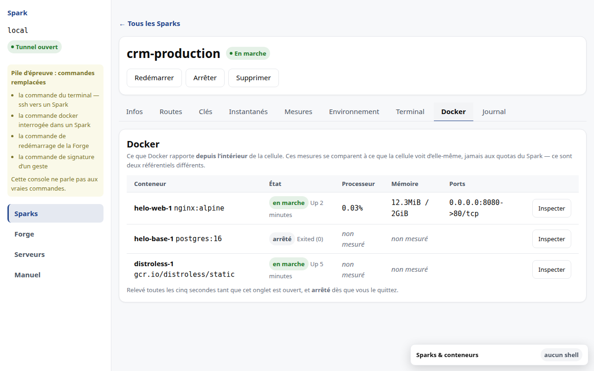
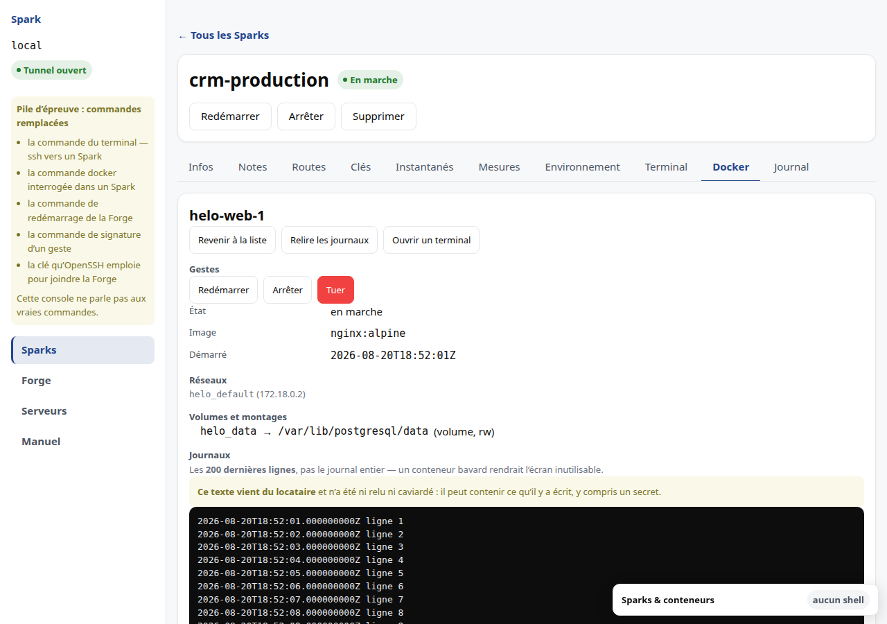
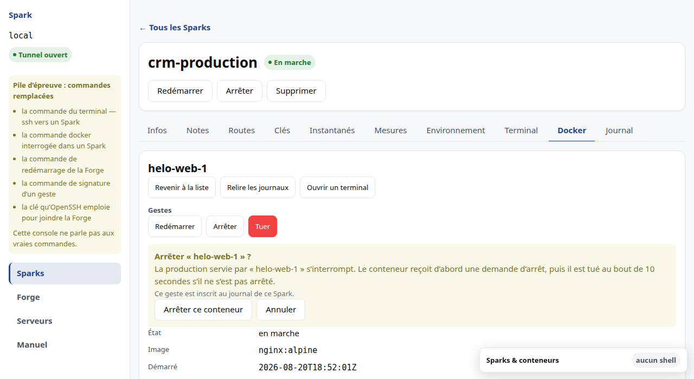
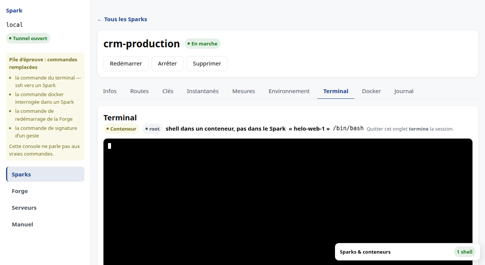
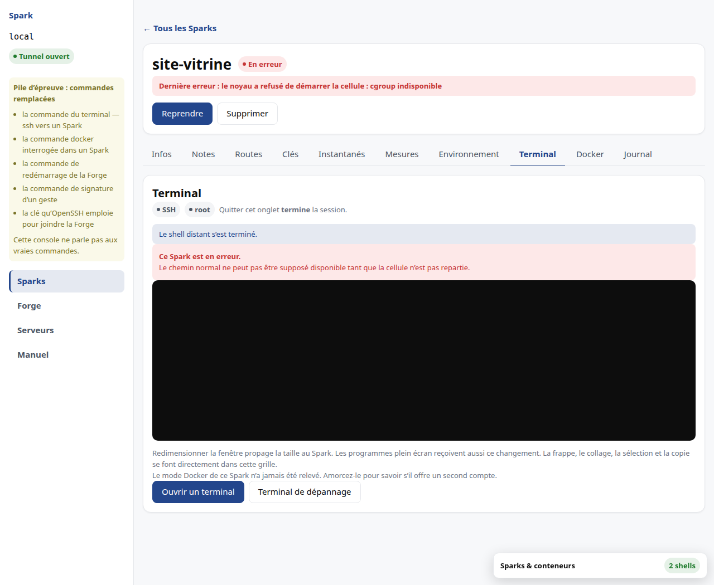

# M8 · Exploiter au quotidien

## Où trouver quoi

La fenêtre d'un Spark est découpée en **facettes**, chacune avec son propre
onglet :

| Onglet | Ce qu'on y lit |
|---|---|
| Infos | l'identité, les ressources, l'adresse privée |
| Routes | les domaines publics qui pointent vers ce Spark |
| Clés | les clés autorisées et la configuration SSH |
| Instantanés | les points de retour arrière |
| Terminal | un shell **dans** le Spark |
| Journal | ce qui s'est passé sur ce Spark |

Les commandes de cycle de vie — démarrer, arrêter, supprimer — restent
au-dessus des onglets : elles concernent le Spark entier, pas une de ses
facettes.

## Les commandes disponibles

L'écran détail n'affiche que les commandes **réellement acceptables** dans l'état
courant. Une commande impossible n'est pas grisée : elle n'est pas affichée. Un
bouton mort vous ferait essayer pour apprendre qu'il ne fait rien.

Quand une opération est en cours — création, démarrage, arrêt, suppression —
aucune commande n'est acceptée, et l'écran le dit en toutes lettres plutôt que
d'exposer des boutons sans effet.

## Protéger un Spark

Chaque Spark porte un **interrupteur de protection**. Tant qu'il est armé, le
serveur refuse toute écriture qui vise ce Spark : commandes de cycle de vie,
reconfiguration, routes publiques, octroi d'une clé, instantanés y compris leur
restauration. Les lectures, elles, ne sont jamais refusées.

Il s'arme avec un mot de passe, depuis la section **Protection** de la fenêtre du
Spark, et se lève avec ce même mot de passe. Réarmer accepte un mot de passe
différent : le produit ne retient pas l'ancien pour le proposer.

Lever la protection la **désarme durablement**, jusqu'à ce que vous la réarmiez.
Il n'y a pas de fenêtre de quelques minutes à surveiller : un déverrouillage
temporaire vous pousserait à travailler vite pour ne pas le rater, ce qui est
l'inverse du but. Un Spark désarmé le dit aussi clairement qu'un Spark protégé,
pour que l'oubli de réarmement se voie. Le badge, lui, suit le Spark jusque dans
la liste.

### Ce dont elle protège, et ce dont elle ne protège pas

Elle arrête le **geste accidentel** : le mauvais Spark sélectionné, la ligne
cliquée trop vite, la commande recopiée d'un autre bocal, le script d'astreinte
lancé sur le mauvais nom.

**Ce n'est pas un contrôle d'accès.** Qui atteint le serveur atteint le registre,
et pourra lever la protection sans mot de passe. Nous ne la présenterons jamais
autrement : la croire infranchissable serait plus dangereux que de ne pas l'avoir.

Elle est néanmoins appliquée par le **serveur** et pas seulement par cet écran —
sans quoi elle ne protégerait pas du cas le plus fréquent, qui est le script et
non l'humain.

### Il n'y a aucune récupération

Un mot de passe perdu ne se récupère pas depuis l'application. Il se lève sur le
serveur, en administrateur. C'est cohérent avec ce que la protection est : un
garde-fou, pas un chiffrement. Prétendre le contraire par un mécanisme de secours
compliqué reviendrait à mentir sur ce qu'elle vaut.

Il n'y a pas non plus de blocage après plusieurs essais ratés. Un compte à
rebours ne gênerait que vous : celui qu'il repousserait a déjà, par construction,
de quoi contourner la protection entière. Chaque tentative est en revanche
enregistrée au journal, réussie comme refusée — jamais le mot de passe lui-même.

### Retirer un accès n'est jamais bloqué

C'est l'exception, et elle est absolue. **Révoquer une clé reste possible sur un
Spark protégé.** Le jour où vous retirez l'accès d'une personne partie ou d'une
clé qui a fuité, un refus ne protégerait rien : il laisserait l'accès en place
parce qu'un interrupteur a été oublié ailleurs.

L'application ne refuse donc pas : elle vous **dit ce que vous touchez**. Elle
nomme les Sparks protégés concernés, un par un, et vous demande de confirmer. La
révocation aboutit ensuite **sans qu'aucune protection soit levée**, et aucun mot
de passe ne vous est demandé — exiger le secret de chaque Spark protégé pour
retirer une clé compromise reviendrait à refuser.

Le partage est simple : **ajouter** un accès à un Spark protégé se refuse,
**en retirer un** se confirme.

### Deux recalculs passent toujours

La redistribution des cœurs et la repondération des poids processeur traversent
un Spark protégé sans être bloquées. Elles n'altèrent ni sa configuration, ni son
état, ni ses données — et les bloquer ferait échouer la création d'un *autre*
Spark parce qu'un troisième est protégé.

## Lire les mesures

La consommation est affichée face à la réservation. Une consommation supérieure à
la réservation est un **burst**, pas un dépassement : elle apparaît en jaune, non
en rouge. Le rouge est réservé au dépassement d'un plafond, qui ne peut se
produire qu'en mode plafonné.

Quand il n'y a rien à mesurer, l'interface le dit plutôt que d'afficher un blanc
ou un zéro trompeur :

| Situation | Ce qui s'affiche |
|---|---|
| Spark arrêté | « Arrêté — aucune mesure d'exécution » |
| Spark déclaré, jamais appliqué | « Pas encore appliqué — rien à mesurer » |
| premier relevé en cours | « Mesure en cours » |
| Spark en erreur | « Indisponible » |
| consommation réellement nulle | `0` |

## Changer les quotas d'un Spark

Un Spark trop petit — ou trop grand — se **redimensionne**. Il n'y a pas à le
supprimer ni à le recréer : la cellule, ses images Docker, ses volumes et sa
configuration restent en place.

**Infos → Ressources → Modifier les quotas.** La fenêtre s'ouvre déjà remplie
des valeurs actuelles ; vous changez celles que vous voulez changer, et rien
d'autre.

Quatre réglages se changent : le **mode CPU**, la **mémoire**, le **disque** et
le **plafond réseau**.

Le mode CPU décide de ce que vous réglez ensuite — une réservation en mode
partagé, un plafond en mode plafonné, un nombre de cœurs en mode dédié. Changer
de mode change donc le champ qui suit, et les réglages de l'ancien mode ne
survivent pas : une réservation sur un Spark plafonné serait une valeur que rien
n'emploie.

### Tout est pris en compte immédiatement

Les quatre réglages prennent effet **sans redémarrer** votre Spark — mesuré sur
la Forge de validation le 2026-08-21, disque et mode CPU compris. La fenêtre le
dit sous chaque champ.

Le manuel a longtemps annoncé l'inverse pour le disque et le mode CPU : tant que
la prise à chaud n'avait pas été mesurée, le produit promettait **moins** que ce
qu'il tient. C'est le bon sens de l'erreur — annoncer un redémarrage qui n'a pas
lieu ne coupe rien, l'inverse coupe un service.

### Ce que vous retirez doit être libre

Réduire un quota sous ce qui est réellement employé est **refusé**, et le refus
dit lequel des deux cas s'est produit :

| Le message parle de… | Ce qu'il faut faire |
|---|---|
| **capacité insuffisante** sur la Forge | libérer de la place sur le serveur, ou demander moins |
| ce que la **cellule emploie** ou **contient** | libérer de la mémoire ou du disque **dans le Spark**, puis recommencer |

Les deux ne se confondent pas, et c'est important : le premier se règle sur la
Forge, le second dans votre Spark. Un message qui les mélangerait vous enverrait
chercher au mauvais endroit.

Deux précisions sur le chiffre que le refus vous annonce :

- **l'occupation du disque compte vos instantanés.** Elle peut donc dépasser
  largement la taille de vos fichiers. Supprimer un instantané devenu inutile
  rend de la place aussi sûrement que supprimer des fichiers ;
- **la mémoire n'est comptée que sur un Spark en marche.** Sur un Spark arrêté,
  elle n'est pas mesurée, et sa réduction n'est donc pas refusée à ce titre.

### Un Spark protégé ne se redimensionne pas

Le bouton reste visible, **désactivé**, avec sa raison. Levez la protection
d'abord (voir plus haut) : c'est un geste distinct, et il doit le rester.

## Passer des variables à votre pile

**Infos → onglet Environnement.** Deux sections : les variables de la **Forge**,
qui descendent dans tous les Sparks, et celles **de ce Spark**, qui ne concernent
que lui.

Chaque ligne dit **d'où vient sa valeur** :

| Ce que la colonne indique | Ce que cela veut dire |
|---|---|
| **Héritée de la Forge** | posée au niveau commun, et personne ne l'a remplacée |
| **Propre à ce Spark** | posée ici, et nulle part ailleurs |
| **Surcharge la Forge** | posée aux deux niveaux ; c'est celle du Spark qui s'applique |

Sans cette colonne, on lit une valeur sans pouvoir dire pourquoi elle est
celle-là — et on va la corriger au mauvais endroit.

La **surcharge se fait nom par nom** : remplacer `SMTP_HOST` sur un Spark ne lui
fait pas perdre le `SMTP_PORT` hérité.

### Une valeur secrète ne se relit pas

Cochez « Déclarer cette valeur secrète » et la valeur devient invisible, pour de
bon : l'écran n'en montrera plus que le **nom**, une **empreinte** et la date du
dernier changement. Elle n'est plus rendue par l'API, ni portée au journal.

L'empreinte sert à répondre à « est-ce la même valeur que sur l'autre Spark ? »
sans la montrer. Elle ne se compare qu'**entre Sparks de la même Forge**.

Il n'existe aucun moyen de la révéler. On la **remplace**, ou on la retire.

**Ce que cela ne protège pas** : la valeur arrive en clair dans votre Spark —
c'est le but, votre application doit pouvoir l'employer — et qui détient les
droits d'administration sur la Forge peut la lire. Ce qui est protégé, c'est
l'affichage accidentel, le journal, l'API et les exports.

### Écrire ne redémarre rien

La pile du locataire lira la nouvelle valeur à son **prochain démarrage**.
L'écran le dit avant que vous n'agissiez, plutôt que de laisser croire à un effet
immédiat. Le locataire attache les fichiers à ses services comme le décrit
[M6](M6-acces.md).

### Un Spark protégé, et la Forge

Sur un Spark protégé, le bouton reste visible, **désactivé** : levez la
protection d'abord. Au niveau de la **Forge**, en revanche, le geste n'est pas
refusé — il **nomme** les Sparks protégés qu'il touchera et vous demande de
confirmer. Refuser sèchement gèlerait toute la Forge dès qu'un seul Spark est
protégé, et l'on finirait par lever les protections pour contourner.

## Comprendre un Spark en erreur

Un Spark en erreur affiche **la cause réelle**, pas un message générique, et
propose **Reprendre**. Le journal, en bas de l'écran, retrace les transitions et
les opérations, avec leur résultat : réussi, refusé ou en erreur.

## Voir ce qui tourne dans votre Spark

L'onglet **Docker** liste vos conteneurs : leur état, ce qu'ils consomment, et
les ports qu'ils publient *à l'intérieur* de la cellule.

La **liste** n'offre aucun geste. C'est délibéré : agir depuis une ligne de
tableau, c'est agir sans avoir regardé, et un clic de travers y arrêterait le
conteneur voisin. Son seul bouton, **Inspecter**, ne fait que *lire*.

Les gestes existent, et ils vivent sur le conteneur **ouvert** — voyez
*Agir sur un conteneur*, plus bas.

### Les mesures ne se comparent pas à vos quotas

Les chiffres de cette page viennent de Docker, **depuis l'intérieur** de votre
Spark. Ils se comparent à ce que la cellule voit d'elle-même, pas aux quotas que
vous avez achetés — ce sont deux référentiels différents, et les additionner
produirait un chiffre qui ne veut rien dire.

Pour vos quotas, regardez l'onglet **Infos**.

Une mesure peut manquer : elle est alors écrite **« non mesuré »**, jamais
ramenée à zéro. Un conteneur arrêté n'a pas de consommation, et un zéro affiché
ferait croire à un conteneur en marche qui ne fait rien.

### Quand la liste est vide, l'écran vous dit pourquoi

Un tableau sans ligne ne vous apprendrait rien. Quatre situations, et elles
n'appellent pas les mêmes gestes :

| Ce que vous lisez | Ce qui se passe | Que faire |
|---|---|---|
| **Aucun conteneur** | Docker tourne, rien n'est lancé | rien — c'est normal |
| **Docker n'est pas installé** | la cellule n'a jamais été amorcée | l'amorcer, onglet *Infos* |
| **Son moteur ne répond pas** | Docker est là, son service est arrêté | le redémarrer dans le Spark |
| **Aucun serveur SSH ne répond** | cet onglet passe par le même chemin que le terminal | voir l'onglet *Terminal* |

**Les deux du milieu se ressemblent** — dans les deux cas « Docker ne marche
pas » — et ce sont les seules à ne pas appeler le même geste. Les confondre vous
ferait réinstaller ce qui est déjà là, et redémarrerait votre moteur Docker pour
rien.

### La console cesse de regarder quand vous partez

La liste se rafraîchit toutes les cinq secondes tant que l'onglet est ouvert, et
**s'arrête dès que vous le quittez**. Ce n'est pas une économie de façade : une
console qui interrogerait en permanence un Spark que personne ne regarde
consommerait votre quota pour rien.

## Ouvrir un conteneur

Cliquez **Inspecter** sur la ligne d'un conteneur. La liste cède la place à sa
fiche : ce qu'il est, à quels réseaux il tient, quels volumes il monte, et les
dernières lignes qu'il a écrites.

**Rien de tout cela n'est relevé d'avance.** La console ne va le chercher qu'au
moment où vous le demandez. Lire les journaux de dix conteneurs toutes les cinq
secondes coûterait dix fois le relevé de la liste à votre quota, pour un texte
que personne ne lit dix fois à la fois.

Tant qu'un conteneur est ouvert, **le relevé de la liste s'arrête** : elle n'est
plus à l'écran, la relever ne servirait personne. *Revenir à la liste* le reprend.

### Ce que la fiche dit, et ce qu'elle refuse de dire

Le **code de sortie** n'apparaît que pour un conteneur **arrêté**. Un conteneur
en marche n'en a pas ; en afficher un — fût-ce zéro — vous ferait lire qu'il
s'est terminé sans erreur alors qu'il tourne encore.

Un réseau ou un volume peut être **« non lu »**. Cela ne veut pas dire qu'il n'y
en a pas : l'identité du conteneur est revenue, cette liste-là non. « Aucun
réseau attaché » et « non lus » sont deux faits différents, et l'écran ne les
confond jamais.

### Les journaux : deux cents lignes, et pas une de plus

Vous voyez les **deux cents dernières lignes**, jamais le journal entier. Quand
la limite est atteinte, l'écran vous le dit. Un conteneur bavard renverrait sinon
des mégaoctets par le tunnel et rendrait la page inutilisable au moment précis où
vous en avez besoin.

Les horodatages sont ceux de **votre** conteneur, écrits tels qu'il les produit.
La console ne les retraduit pas dans le fuseau de votre poste : vous devez
pouvoir recoller ce que vous lisez ici avec ce que vous lisez chez vous.

*Relire les journaux* redemande la lecture. Il n'y a pas de suivi en continu :
un journal qui défilerait tout seul consommerait votre quota sans fin.

> **Ce texte n'a été ni relu ni caviardé.** Il vient de vos conteneurs, tels
> qu'ils écrivent. Si l'un d'eux journalise un mot de passe, une clé ou un jeton,
> il apparaîtra ici. C'est aussi vrai de toute personne à qui vous donnez accès à
> cette console.

## Agir sur un conteneur

Un conteneur ouvert porte ses gestes, et **seulement ceux qui ont un sens** :

| Ce que fait le conteneur | Ce qu'on vous propose |
|---|---|
| il tourne | *Redémarrer*, *Arrêter*, *Tuer* |
| il est arrêté | *Démarrer* |
| il a disparu | rien — agir sur ce qui n'existe plus n'est pas une commande |

Le produit sait faire **cela, et rien de plus**. Il ne lance pas de pile Compose,
ne construit pas d'image et ne tire rien d'un registre : ce n'est pas un outil de
déploiement, c'est un outil pour reprendre un conteneur tombé.

### Chaque geste se confirme, et la confirmation dit l'effet

Vous ne lirez jamais « êtes-vous sûr ». Vous lirez ce qui va se passer :
« La production servie par *crm-web-1* s'interrompt. »

*Arrêter* et *Tuer* ne sont pas la même chose, et l'écran ne les peint pas de la
même couleur :

- **Arrêter** demande au conteneur de s'arrêter, puis le tue au bout de dix
  secondes s'il ne l'a pas fait. Un programme bien écrit termine ce qu'il faisait.
- **Tuer** ne demande rien. Ce que le conteneur était en train d'écrire est perdu.
  C'est le seul geste en rouge, et le seul dont le bouton d'engagement l'est aussi.

Chaque geste est **inscrit au journal** de votre Spark, avec le nom du conteneur.
La lecture, elle, ne l'est pas : consulter n'interrompt rien.

### Ce que l'écran affiche après, et pourquoi ce n'est pas ce que vous avez demandé

Aussitôt le geste passé, la console **relit** le conteneur et affiche ce que la
Forge lui rend — jamais l'état qu'elle suppose atteint. Un « c'est fait » suivi
d'un conteneur toujours en marche serait un mensonge poli ; vous voyez donc le
véritable état, et les gestes proposés changent avec lui.

« Le geste a abouti » ne promet pas non plus un arrêt *propre* : un conteneur qui
ignore la demande d'arrêt est tué au bout des dix secondes, et se termine alors
en erreur. L'état relu vous le dira.

Deux réponses ne sont **pas** des pannes, et l'écran ne les peint pas en rouge :

- « Ce conteneur ne tournait pas » — vous avez tué un conteneur déjà arrêté.
  L'état que vous vouliez est déjà celui-là.
- « Ce conteneur a disparu » — il n'existe plus. Voir juste en dessous.

### Un Spark protégé refuse les gestes, pas la lecture

Si vous avez armé la protection (chapitre M8, *Protéger un Spark*), les gestes
restent **visibles mais désactivés**, et l'écran vous dit comment avancer : levez
la protection sur l'onglet *Infos*.

Ils restent visibles à dessein — les faire disparaître vous laisserait croire que
le produit ne sait pas arrêter un conteneur.

Tout le reste de l'onglet continue de fonctionner : la liste, l'inspection, les
journaux. **Et le terminal aussi.** Si vous devez couper un conteneur sans
attendre — parce qu'il fuit, parce qu'il tourne fou —, ouvrez le terminal et
tapez la commande. La protection est là pour arrêter le geste distrait, jamais le
geste urgent.

> **Ce que la protection n'est pas.** Ce refus est rendu par la console, pas par
> votre Spark : Docker, chez vous, n'en sait rien. C'est un garde-fou, pas un
> contrôle d'accès — et le produit ne prétend pas vous empêcher de contourner ce
> qu'il ne peut pas vous interdire.

## Entrer dans un conteneur

Un conteneur qui **tourne** porte un bouton *Ouvrir un terminal*. Vous atterrissez
sur l'onglet *Terminal*, dans un shell **du conteneur** — pas du Spark.

La bannière le dit en toutes lettres, et nomme le conteneur. Ce n'est pas une
précaution de style : deux conteneurs d'une même pile se ressemblent, et taper la
bonne commande dans le mauvais est l'erreur que cette ligne existe pour empêcher.

Tout le reste fonctionne comme le terminal du Spark (voir *Le terminal*,
plus bas) : quitter l'onglet **termine** la session, l'inactivité la ferme après
un avertissement, et rien de ce que vous tapez n'entre au journal.

### Quel shell vous obtenez, et pourquoi la console le cherche d'abord

La console ne peut pas savoir ce que vous avez mis dans votre image. Elle
**regarde donc avant d'ouvrir** : `bash` s'il est là — vous y gagnez
l'historique et l'édition de ligne —, sinon `sh`.

Ce détour vous coûte une fraction de seconde à l'ouverture. Il vous évite une
fenêtre noire dont il faudrait deviner pourquoi elle est vide.

Trois réponses possibles, et aucune n'est une panne :

| Ce que vous lisez | Ce qui se passe |
|---|---|
| **Ce conteneur n'a pas de shell** | votre image n'en embarque aucun — c'est le cas des images *distroless*, et c'est un bon choix de sécurité |
| **Ce conteneur est arrêté** | on n'entre pas dans un conteneur qui ne tourne pas ; démarrez-le d'abord |
| **Ce conteneur a disparu** | il n'existe plus sur ce Spark |

Dans les trois cas, l'écran vous le dit et **n'ouvre rien**. Le terminal du Spark,
lui, reste disponible : si vous devez inspecter l'image d'un conteneur sans
shell, c'est de là que vous le ferez.

### La protection ne vous ferme pas cette porte

Un Spark **protégé** refuse les gestes sur ses conteneurs — démarrer, arrêter,
tuer — mais **laisse entrer**. C'est délibéré : le terminal est l'outil de
diagnostic, et le bloquer vous pousserait à désarmer la protection pour regarder,
donc à oublier de la réarmer.

C'est aussi votre issue de secours. Si un conteneur doit être coupé sans attendre,
entrez-y et tapez la commande : vous n'avez rien à désarmer.

Chaque ouverture et chaque fermeture sont **inscrites au journal**, sous une
action qui leur est propre — distincte de celle d'un terminal de Spark. Le
journal dira qu'une session a eu lieu, dans quel conteneur et combien de temps ;
**jamais ce que vous y avez fait**.

### Si le conteneur disparaît pendant que vous le regardez

Vous pouvez supprimer un conteneur entre le moment où la liste l'a vu et celui où
vous l'ouvrez. L'écran vous dit alors qu'il **a disparu**, en jaune et non en
rouge : ce n'est pas une panne, c'est l'ordre normal des choses.

## Le terminal

L'onglet **Terminal** ouvre un shell dans le Spark. C'est votre poste qui s'y
connecte, avec votre clé — le serveur qui gère les Sparks n'est pas sur ce
chemin, et il n'apprend rien de ce que vous y faites.

Autrement dit : la console vous épargne les gestes, pas les droits. Elle fait ce
que vous feriez avec un terminal et votre clé.

### Ouvrir, écrire, quitter

Le bouton **Ouvrir un terminal** démarre la session. Tapez votre commande dans le
champ, `Entrée` l'envoie.

**Quitter l'onglet termine la session** — c'est écrit à l'écran, et c'est
délibéré : une session qui survivrait à sa fenêtre serait un shell administrateur
abandonné dont plus personne ne se souvient. Fermer l'onglet du navigateur a le
même effet.

Une session laissée sans activité se ferme aussi, **après un avertissement**
affiché avant la coupure. Une touche suffit à la conserver.

### Ce que le journal retient

L'ouverture et la fermeture, avec leur durée. **Rien de ce que vous tapez**, et
rien de ce qui s'affiche.

Ce n'est pas un oubli. Le caviardage du journal travaille sur des champs nommés ;
il ne saurait pas nettoyer un flux où un mot de passe est tapé au milieu d'une
ligne. Enregistrer les frappes reviendrait à créer un dépôt de secrets en clair.

**Conséquence à connaître** : le journal dira qu'une session a eu lieu, jamais ce
qui y a été fait. Si vous voulez cette trace-là, elle doit venir de l'intérieur
du Spark.

### Ce qui peut manquer

**Un Spark déclaré mais jamais créé** n'a pas de cellule où se connecter. Ses
ressources sont réservées et son adresse attribuée, mais rien ne tourne encore :
l'écran vous le dit au lieu d'afficher une erreur technique.

### Quand le shell se termine tout seul

Si la session se ferme sans que vous l'ayez demandé, la console **vérifie le
serveur SSH du Spark** et vous dit ce qu'elle a trouvé. Elle ne le devine pas :
elle ne conserve rien de ce qui s'est affiché, donc elle mesure.

Trois réponses possibles, et elles n'appellent pas les mêmes gestes :

| Ce qui est mesuré | Ce que ça veut dire | Que faire |
|---|---|---|
| rien n'écoute sur le port 22 | aucun serveur SSH dans ce Spark | le **terminal de dépannage**, ci-dessous |
| le serveur répond et refuse la clé | un problème d'accès, pas une panne | réaccorder la clé ([M6](M6-acces.md)) |
| le serveur répond | le shell s'est terminé pour une autre raison | rouvrir |

Si la vérification elle-même échoue, l'écran le dit aussi : la cause n'est alors
**pas établie**, et il ne prétend pas le contraire.

### Quand rien ne répond : le terminal de dépannage

Il arrive qu'un Spark tourne et que le chemin normal ne mène nulle part : son
serveur SSH n'est pas installé, il s'est arrêté, ou le Spark est en erreur. Le
bouton **Terminal de dépannage** existe pour ce cas-là, et pour lui seul.

Ce chemin ne passe pas par le Spark : **la console demande au serveur qui gère
les Sparks d'exécuter un shell root à l'intérieur de la cellule.** C'est un
pouvoir qu'elle n'emploie nulle part ailleurs — partout ailleurs, elle fait ce
que vous feriez avec votre clé, et rien de plus. C'est pourquoi elle vous le
demande en le nommant, plutôt que de vous faire cliquer « confirmer ».

**Le serveur décide, pas l'écran.** Vous pouvez toujours demander ce chemin ; il
n'est accordé que si le Spark est en erreur ou si rien ne répond sur son port
22. Sinon vous recevez un refus qui dit pourquoi, et le chemin normal reste à
côté, toujours disponible.

Un cas mérite d'être distingué, parce qu'il ressemble au précédent sans l'être :
**si le serveur SSH du Spark répond mais refuse votre clé**, le dépannage n'est
pas la réponse. C'est un problème d'accès, et il se règle depuis l'onglet
**Clés** ([M6](M6-acces.md)). L'écran vous le dit ainsi.

Pendant toute la session de dépannage, une **bannière rouge** rappelle par quel
chemin vous êtes entré et pourquoi. Elle ne disparaît pas, y compris après la fin
du shell distant — c'est précisément le moment où on l'oublierait.

**Ces ouvertures se comptent.** Elles sont inscrites au journal sous une entrée
distincte de celle d'une session normale, de sorte qu'un relevé montre combien de
fois cette voie a servi. Une voie d'exception qu'on ne peut pas compter cesse
d'en être une.

### Confort et accessibilité

Le **mode lecteur d'écran** fait annoncer la sortie par une synthèse vocale. Un
terminal s'utilise au clavier par construction, mais il n'est pas *lisible* par
défaut. Le réglage est retenu pour la durée de votre visite.

Redimensionner la fenêtre propage la taille au Spark. Attention : un programme
plein écran **déjà lancé** ne s'en apercevra pas — il faut le relancer.

> **Limite connue.** Le fait que la connexion atteigne réellement un Spark n'a
> pas encore été constaté sur une Forge réelle : cela demande une machine avec
> Incus et un serveur SSH installé dans le Spark. L'image de base n'en embarque
> pas.
