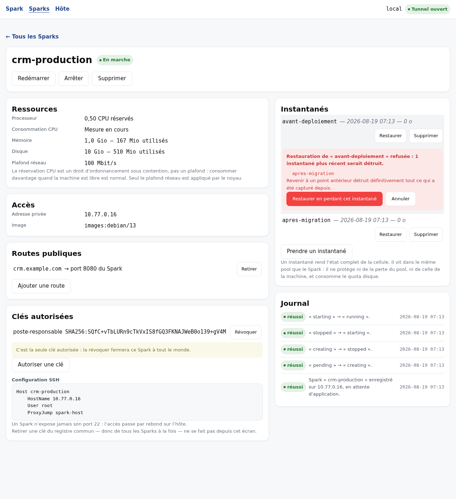

# M9 · Instantanés et sauvegarde

## Ce qu'un instantané est

Un retour arrière de la **cellule entière**, pris sans interrompre son exécution.
Il sert à revenir avant un déploiement raté.

## Ce qu'il n'est pas

**Ce n'est pas une sauvegarde.** Il vit dans le même pool de stockage que le
Spark : il ne protège ni de la perte de ce pool, ni de celle de la machine.

Deux conséquences à ne pas perdre de vue :

- **un instantané consomme votre quota disque.** Il coûte d'abord zéro — il
  partage tous ses blocs avec le Spark — puis grossit à mesure que le Spark s'en
  écarte. Un Spark qui en accumule voit son espace diminuer sans qu'aucun fichier
  n'ait été ajouté ;
- le système de fichiers est figé à un instant qui ne correspond à aucun point de
  cohérence applicatif. Une base de données en cours d'écriture se retrouvera, à
  la restauration, dans l'état d'un arrêt brutal.

Vos sauvegardes applicatives restent nécessaires, et ailleurs.

## Restaurer

La restauration **écrase l'état courant**. Elle demande donc une confirmation qui
nomme ce qui sera perdu.

Revenir à un point ancien détruirait tout ce qui a été capturé depuis. Le produit
**refuse** plutôt que de le faire en silence, et **nomme les instantanés qui
bloquent**.

L'acceptation de leur perte n'est offerte **qu'après ce refus**, jamais avant.
C'est délibéré : une case à cocher présentée d'avance serait cochée par habitude,
et vous perdriez des instantanés que vous n'avez jamais regardés. Le refus est ce
qui rend la perte visible.

## Supprimer un instantané

Irréversible. La confirmation nomme l'instantané.
